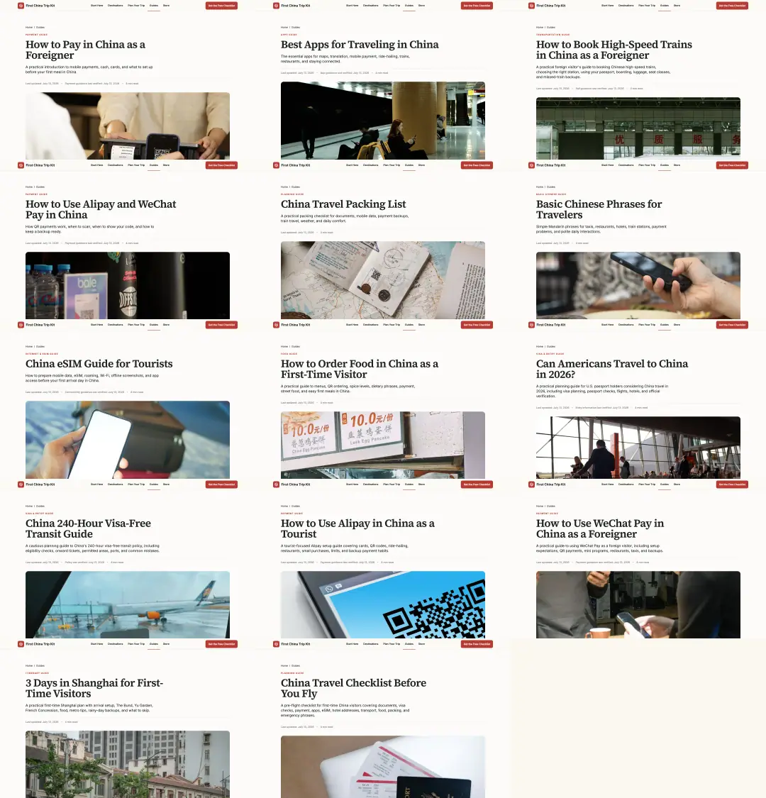
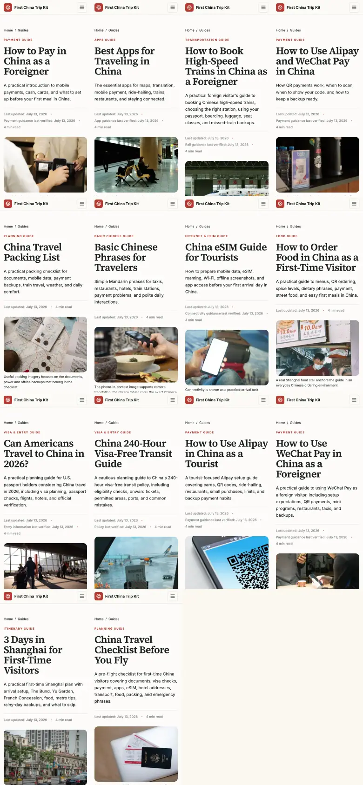
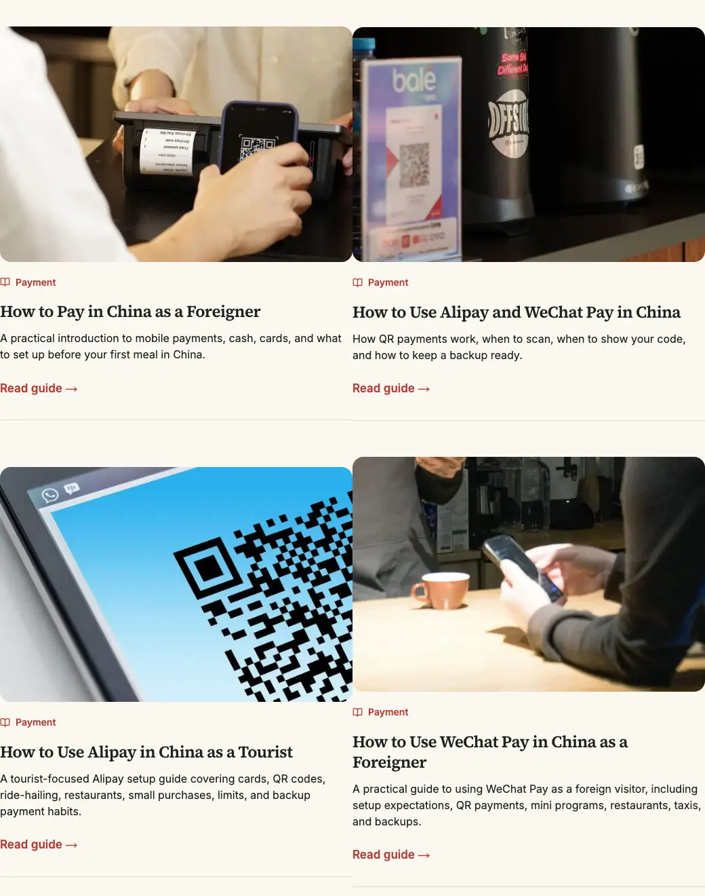
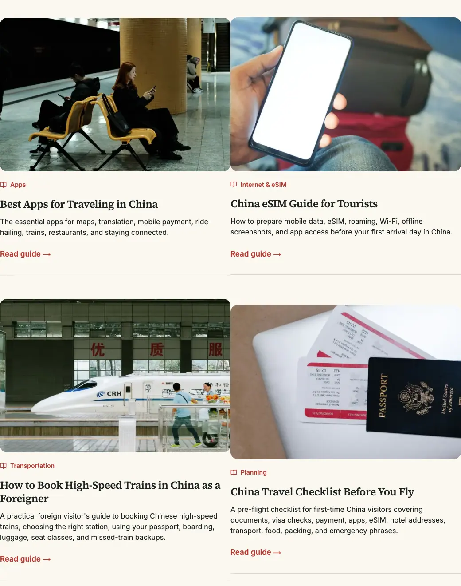
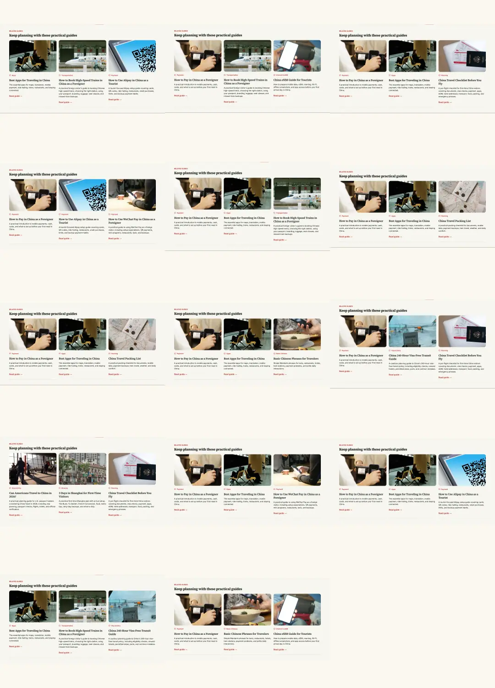

# First China Trip Kit — Phase C Guide Image, Content and Reading Experience Upgrade

Generated: 2026-07-13  
Repository: `CHENGWEE711/first-china-trip-kit`  
Branch: `audit/full-site-content-image-upgrade`  
Stage B baseline: `01b05de27060406476455ae25ab75b42270df5db`  
Implementation tip before this documentation commit: `84f972f`

> Scope lock: this phase covers the 14 public Guide pages, the Guide list and Guide references on shared entry surfaces. It does not begin the city, homepage, Store or global-design remediation planned for later phases. No merge to `main` and no production deployment were performed.

## Executive result

**PASS.** Every Guide now has a distinct semantic Hero and Card asset, tool Guides no longer rely on decorative scenery, payment/visa/App/transport subjects use traceable real photography, and responsive delivery prevents the larger source files from causing a measurable first-screen regression in the sampled Guides.

| Metric | Baseline | Final | Change |
| --- | ---: | ---: | ---: |
| Public Guides | 14 | 14 | — |
| Modified Guide pages | 14 | 14 | All Guides reviewed |
| Dedicated Hero replacements | 0 | 14 | +14 |
| Dedicated Card replacements | 0 | 14 | +14 |
| Hero and Card sharing one file | 14 | 0 | -14 |
| Inline image slots | 42 | 27 | -15 |
| Inline assignments retained / replaced / removed | — | 25 / 2 / 17 | Intentional 0–3 per Guide |
| Deleted obsolete Guide image files | 0 | 2 | Unused only |
| Repeated inline-image groups | 10 | 5 | -5 |
| Hero files below 2000px | 13 | 0 | -13 |
| Card files below 1400px | 0 | 0 | — |
| Assets above 700KB | 0 | 0 | — |
| Inline matched / partial / mismatch | 25 / 13 / 4 | 27 / 0 / 0 | All final slots matched |
| Missing files / credit records | 0 / 0 | 0 / 0 | — |
| Guide-scope first-party provenance records added | 0 | 1 | Product CTA cover registered |

The final detailed matrices are in [`PHASE_C_GUIDE_IMAGE_FINAL.md`](./PHASE_C_GUIDE_IMAGE_FINAL.md), [`PHASE_C_GUIDE_IMAGE_FINAL.json`](./PHASE_C_GUIDE_IMAGE_FINAL.json) and [`IMAGE_USAGE_AUDIT.md`](./IMAGE_USAGE_AUDIT.md).

## Image system decisions

- Each Guide now uses a 2400×1600 WebP Hero and an independently cropped 1800×1200 WebP Card.
- The 28 derivatives come from 14 traceable source photographs. No hotlinks are used.
- Hero source files average 248,903 bytes and max out at 497,986 bytes. Card files average 143,945 bytes and max out at 313,902 bytes.
- Card payload across all Guides is slightly lower than baseline despite the higher resolution: 2,015,224 bytes versus 2,023,324 bytes.
- Hero source payload is larger because 13 low-resolution sources were replaced; rendered transfer remains flat because `next/image` serves responsive derivatives.
- Only the Guide Hero and the Guide-list featured Card are high priority. All body images and Related Guide Cards remain lazy.
- Basic Chinese and eSIM use no body photographs because phrase tables and exact setup guidance carry more value than decorative scenery or an unverifiable settings screenshot.
- Payment imagery shows real QR/payment contexts without fabricated wallet screens, implied approvals or unauthorized App logos.
- Visa imagery uses neutral airport, boarding-pass and onward-flight context; no fabricated visa, entry stamp or guaranteed-admission visual is used.

## New image source register

Every source is also serialized with derivative paths, dimensions and byte sizes in [`PHASE_C_GUIDE_ASSET_MANIFEST.json`](./PHASE_C_GUIDE_ASSET_MANIFEST.json) and mapped to a complete record in `data/image-credits.json`.

| Guide | Theme | Photographer | Source |
| --- | --- | --- | --- |
| How to Pay in China as a Foreigner | Customer-presented QR at checkout | iMin Technology | [Pexels 12935051](https://www.pexels.com/photo/a-close-up-shot-of-a-person-scanning-a-qr-code-12935051/) |
| Best Apps for Traveling in China | Travelers using phones in a metro station | Elif | [Pexels 31216218](https://www.pexels.com/photo/people-using-phones-in-a-subway-station-31216218/) |
| How to Book High-Speed Trains | Chinese CRH train and station context | Leon Huang | [Pexels 7494174](https://www.pexels.com/photo/high-speed-train-at-a-station-in-china-7494174/) |
| How to Use Alipay and WeChat Pay | Merchant QR sign at a cafe counter | Ali Askar | [Pexels 33792076](https://www.pexels.com/photo/cafe-interior-with-coffee-grinders-and-qr-code-33792076/) |
| China Travel Packing List | Documents and practical packing items | Taryn Elliott | [Pexels 5405596](https://www.pexels.com/photo/travel-documents-and-necessities-5405596/) |
| Basic Chinese Phrases | Phone used in a restaurant context | Kuiyibo Campos | [Pexels 13639635](https://www.pexels.com/photo/hand-taking-a-photo-of-a-food-with-a-smart-phone-13639635/) |
| China eSIM Guide | Phone checked beside airport luggage | Towfiqu barbhuiya | [Pexels 15068317](https://www.pexels.com/photo/person-holding-a-phone-15068317/) |
| China Food Ordering Guide | Real Shanghai street-food stall and menu | Maria Burnay | [Pexels 24349885](https://www.pexels.com/photo/street-food-market-shanghai-china-24349885/) |
| Can Americans Travel to China in 2026? | International airport arrivals | Magic K | [Pexels 6726195](https://www.pexels.com/photo/busy-people-on-the-airport-terminal-6726195/) |
| China 240-Hour Visa-Free Transit Guide | Boarding pass and onward aircraft | Natã Romualdo | [Pexels 4606721](https://www.pexels.com/photo/crop-traveler-with-smartphone-and-boarding-pass-in-airport-4606721/) |
| How to Use Alipay in China | Customer-presented QR pattern | Pixabay | [Pexels 278430](https://www.pexels.com/photo/qr-code-on-screengrab-278430/) |
| How to Use WeChat Pay in China | Phone used during a merchant interaction | Sıla Onorevole | [Pexels 31713078](https://www.pexels.com/photo/casual-interaction-at-a-modern-cafe-bar-counter-31713078/) |
| 3 Days in Shanghai | Historic storefronts and modern towers | Margo Evardson | [Pexels 35554911](https://www.pexels.com/photo/bustling-street-scene-in-shanghai-china-35554911/) |
| China Travel Checklist Before You Fly | Passport, boarding passes and laptop | RDNE Stock project | [Pexels 7310015](https://www.pexels.com/photo/close-up-shot-of-a-passport-and-tickets-on-top-of-a-laptop-7310015/) |

## Content corrections

- All 14 Guides now show `Last updated: July 13, 2026`; original publication dates remain separate in structured data.
- Payment Guides now carry an explicit verification label, failure-safe language and a current official payment-services source. Claims about card support, verification and interfaces are framed as changeable rather than guaranteed.
- Best Apps and eSIM now separate essential categories from provider-specific promises. The eSIM Guide explicitly avoids claiming that a provider, app, roaming path or VPN will always work and links to current official telecom guidance.
- The high-speed rail Guide now uses current 12306 identity/passport guidance and shows genuine CRH/station context rather than a generic overseas train.
- The U.S.-passport Guide now states that, as checked on 2026-07-13, the United States is not on the official unilateral 30-day visa-free list; ordinary tourism generally needs the appropriate visa unless an exact route qualifies under another policy. Admission is never described as guaranteed.
- The 240-hour transit Guide retains the current official snapshot: 55 eligible nationalities, 65 ports and permitted areas in 24 provincial-level regions, together with the third-country/region rule, port/area checks and a non-legal-advice disclaimer.
- Related Guide groups were tightened so the App, rail, combined-payment and Shanghai Guides lead to the most relevant next decision instead of broad cross-linking.
- Two old, fully unreferenced Guide images and their obsolete credit records were deleted after repository-wide verification.

## Keyword and intent overlap audit

The full analysis is in [`PHASE_C_CONTENT_OVERLAP_AUDIT.md`](./PHASE_C_CONTENT_OVERLAP_AUDIT.md).

- The payment hub owns the four-layer payment plan and failure handling.
- The combined Alipay/WeChat article owns shared QR mechanics; the individual Alipay and WeChat articles own product-specific setup and recovery paths.
- Best Apps owns the category-level stack; eSIM owns connectivity preparation; rail owns 12306, passport and station workflows.
- Visa/entry eligibility remains separate from the Shanghai itinerary and airport-led transit itinerary.
- Packing owns what to bring; the pre-flight checklist owns final go/no-go verification.
- All Guides retain self-canonicals. No deletion, merge or canonical consolidation was justified in Phase C.

## SEO and structured-data changes

- Every Guide retains a unique title, meta description, H1, canonical and Breadcrumb.
- Every Guide now uses its own dedicated 2400×1600 Hero for Open Graph, Twitter Card and Article JSON-LD.
- Article JSON-LD now separates `datePublished` from `dateModified` and includes the Guide Hero.
- Published dates remain 2026-07-07 or 2026-07-08; modified dates are 2026-07-13.
- No fabricated reviewer, expert identity or unverifiable professional-review claim was introduced.
- Existing FAQ structured data remains tied to visible FAQs; no hidden FAQ content was added.

## Accessibility and reading experience

- Non-decorative images have concise content-and-purpose alt text; captions add context instead of mechanically repeating alt text.
- Body images are placed before the section they support rather than at fixed decorative intervals.
- All Guides allow 0–4 body figures based on instructional value; the final range is 0–3.
- Desktop sticky contents, mobile collapsed contents, section anchors, browser-back restoration, keyboard focus and Escape handling pass Playwright.
- All 14 pages pass 390px and 1440px overflow checks.
- Browser QA found zero site-origin console errors or warnings after marking the Guide-list LCP Card as priority and declaring smooth-scroll behavior. One error from the user's Immersive Translate extension was excluded because it originated from `chrome-extension://`, not the site.

## Performance comparison

Method: the same three priority Guides were measured at the Stage B baseline and current branch using a warmed local Next.js dev server, a fresh Chromium context per sample and a 1440×900 viewport. This is a controlled regression check, not a production Lighthouse claim. Raw data: [`PHASE_C_GUIDE_PERFORMANCE_BASELINE.json`](./PHASE_C_GUIDE_PERFORMANCE_BASELINE.json) and [`PHASE_C_GUIDE_PERFORMANCE_CURRENT.json`](./PHASE_C_GUIDE_PERFORMANCE_CURRENT.json).

| Metric, three-Guide average unless noted | Baseline | Final | Result |
| --- | ---: | ---: | --- |
| LCP | 116ms | 116ms | No change |
| CLS | 0 | 0 | Pass, below 0.1 |
| First-load request count | 24 | 24 | No change |
| First-load image request count | 1 rounded | 1 rounded | No change |
| First-load image transfer | 63,138 bytes | 62,493 bytes | -645 bytes (-1.0%) |
| Maximum transferred image | 74,950 bytes | 84,622 bytes | +9,672 bytes, still small |
| JavaScript transfer | 786,786 bytes | 786,838 bytes | +52 bytes (effectively flat) |
| DOM elements | 707 | 704 | -3 |
| Loaded but zero-size images | 0 | 0 | No unused loaded image |

No body image is eager. The first screen does not request the page's unused body imagery, no third-party image plugin was added and no library image is hotlinked.

## Automated verification

| Check | Result |
| --- | --- |
| `npm install` | PASS; 0 vulnerabilities |
| `npm run lint` | PASS |
| `npm run typecheck` | PASS |
| `npm test` | PASS; 24/24 |
| `npm run build` | PASS; 74 routes generated |
| `npm run audit:images` | PASS; 74 build surfaces inspected, 0 missing image files |
| Guide-specific image audit | PASS; 87 referenced local images, 0 errors, 0 warnings |
| Phase C final audit | PASS; 14 Guides, 0 low-resolution Heroes, 0 inline mismatch |
| Playwright desktop/mobile suite | PASS; 74 passed, 46 intentionally skipped by project conditions |
| Browser manual QA | PASS; 14/14 mobile routes, Guide list interaction, desktop/mobile screenshots, zero site-origin console issue |

The broader full-site audit still reports later-phase findings outside this scope, including non-Guide low-resolution/oversized assets, unused assets and first-party provenance gaps. These were not silently changed in Phase C.

## Visual acceptance evidence

The committed evidence folder contains 63 optimized WebP screenshots (approximately 9.5MB): desktop Hero at 1440px, mobile Hero at 390px, full desktop pages and Related Guide sections for all 14 Guides, plus desktop/mobile Guide lists and Card comparisons.

Representative full-page evidence:

- [`Guides list — desktop`](./phase-c-guide-visual-qa/guides-list-desktop-full.webp)
- [`Guides list — mobile`](./phase-c-guide-visual-qa/guides-list-mobile-full.webp)
- [`How to Pay in China — full page`](./phase-c-guide-visual-qa/how-to-pay-in-china-as-a-foreigner-desktop-full.webp)
- [`Best Apps — full page`](./phase-c-guide-visual-qa/best-apps-for-traveling-in-china-desktop-full.webp)
- [`240-Hour Visa-Free Transit — full page`](./phase-c-guide-visual-qa/china-240-hour-visa-free-transit-guide-desktop-full.webp)
- [`High-Speed Rail — full page`](./phase-c-guide-visual-qa/how-to-book-high-speed-trains-in-china-desktop-full.webp)
- [`eSIM — full page`](./phase-c-guide-visual-qa/china-esim-guide-for-tourists-desktop-full.webp)
- [`First Trip Checklist — full page`](./phase-c-guide-visual-qa/china-travel-checklist-before-you-fly-desktop-full.webp)

Manual review conclusion: the Guide identities are visually distinguishable, mobile crops preserve the subject, payment/tool Cards do not collapse into one repeated visual, body-image frequency remains restrained, and the pages do not read like a generic tourism-stock collage.

## Stage C commits

1. `1cf7c3b` — Audit guide imagery and content overlap
2. `b652141` — Upgrade guide imagery and reading flow
3. `97e8f69` — Refresh guide content and time-sensitive sources
4. `e6b118d` — Optimize guide image payloads
5. `8c0a1ca` — Clarify guide content boundaries
6. `2c21069` — Tune Guide image loading and navigation
7. `84f972f` — Add guide image validation and regression tests
8. `Document phase C results` — this report, final matrices and screenshot evidence

## Remaining issues and explicit stop point

- Official entry, payment, rail and telecom requirements remain time-sensitive; the Guides display verification dates and continue to require official confirmation before travel.
- The full-site audit's city/home/Store/global-image findings remain intentionally unresolved for their later scoped phases.
- The 5 remaining inline duplicate groups are deliberate reuse of relevant contextual assets across closely related Guides; none is an obvious semantic mismatch.
- No merge to `main`, Vercel deployment, domain change or environment-variable change is part of Phase C.
- Phase C stops here and awaits acceptance. Phase D has not started.
