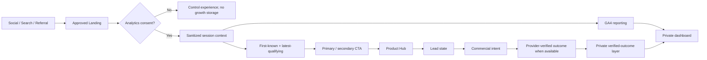
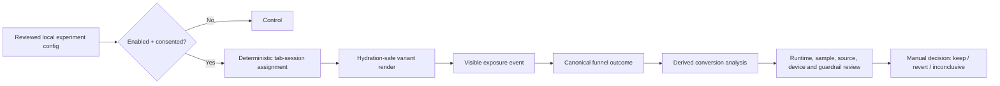
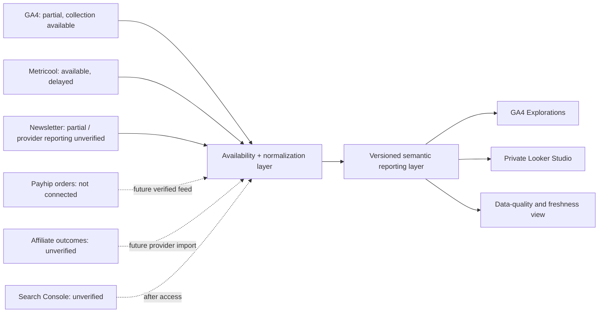

# First China Trip Kit V3 Phase 4B — Growth Optimization Platform Architecture

Document status: architecture-only candidate for independent review

Architecture branch: `feat/v3-phase4b-growth-platform-architecture`

Audit date: 2026-07-19 (Asia/Shanghai)

No application code, Preview or Production deployment is authorized by this document.

## 1. Executive summary

First China Trip Kit already has the beginnings of a measurable acquisition
system: three Phase 4A social Landings, GA4, Metricool, Newsletter/Brevo,
Payhip links, affiliate links, Payment and Visa Hubs, and many custom events.
The missing layer is not another public product. It is a small, governed contract
that makes the existing commercial funnel trustworthy.

The audit found four structural problems:

1. Campaign context is stored as one unvalidated, tab-scoped UTM object and is
   not consistently used by Landing events.
2. Parallel event names cause one Newsletter, paid-Guide, affiliate or Visa
   action to be counted more than once.
3. Clicks exist, but Payhip orders/refunds/revenue and affiliate conversions/
   commissions are not connected. They cannot be inferred.
4. GA4, Metricool and campaign storage currently start without an explicit
   consent gate, and complete URLs can carry query values into analytics.

The recommended architecture is conservative:

```text
GA4 session acquisition and canonical website events
+ consent-aware tab session context for internal navigation
+ Metricool as the separate social-performance system
+ provider-confirmed commerce outcomes only after a verified integration
```

For the first Phase 4B implementation, use **Option A: GA4 Explorations plus a
private Looker Studio report**. Keep Metricool beside it, not blended into the
GA4 Landing-session denominator. Move to **Option C: Hybrid** only after Payhip
or an affiliate provider supplies a reviewed, transaction-backed result source.
Do not build a custom dashboard or database now.

The recommended attribution model is **session-level Landing attribution with
first-known and latest-qualifying campaign context**, stored only after the
approved consent decision and expiring after 30 minutes of inactivity. A
same-tab context can survive refresh, while explicit clone/restore guards prevent
an active copied tab from silently sharing attribution. It creates no persistent
user ID, fingerprint or cross-device profile.

Experiments remain disabled until the consent/data contract is implemented and
two clean weeks establish a baseline. The first permitted experiment is a
low-risk, below-fold CTA wording/order test with one primary metric, guardrails,
a manual decision and a control kill switch.

Architecture recommendation: **PROCEED TO INDEPENDENT ARCHITECTURE REVIEW**.
Runtime implementation is conditional on the consent posture, GA4 administrative
access and provider-outcome access listed in Section 37.

## 2. Confirmed Phase 4A baseline

The accepted baseline supplied for this task is:

| Item | Accepted value |
| --- | --- |
| Phase 4A application merge | `a74abdcc18eeaeb387901836f25eeade64f19cae` |
| Phase 4A acceptance evidence | `66ed82edcf3eca9a39a1f7b6894572394f75a019` |
| Production deployment | `dpl_c938u4DbwoCvSzJ1APzTCRdZwkaU` |
| Production domain | `https://www.firstchinatripkit.com` |
| Phase 4A acquisition routes | `/landing/pay-in-china`, `/landing/china-visa-free`, `/landing/china-checklist` |

Phase 4A is treated as merged, deployed and accepted. This architecture task
does not repeat that release, change the accepted Landings, schedule social
content or touch Production.

## 3. Repository starting SHA

The architecture branch was created from `main` at:

```text
66ed82edcf3eca9a39a1f7b6894572394f75a019
```

This matches the expected starting SHA. The branch is:

```text
feat/v3-phase4b-growth-platform-architecture
```

Only the four required architecture documents are in scope. No proof-of-concept
application file is required because the code and connected systems supplied
enough evidence to resolve the architecture.

## 4. Current analytics inventory

| Layer | Current location | What works | Main limitation |
| --- | --- | --- | --- |
| Generic event dispatcher | `lib/analytics.ts` | Sends to `gtag` or `dataLayer` | Arbitrary names/parameters; no global sanitizer, dedupe or destination gate |
| GA4 loader | `components/GoogleAnalytics.tsx` | Loads in Vercel Production when configured | No consent gate; Admin configuration and report access unverified |
| SPA page views | `components/GoogleAnalyticsPageView.tsx` | Tracks client path changes | Sends complete location; possible interaction with automatic/history page views |
| Metricool tracker | `components/MetricoolAnalytics.tsx` | Loads in Production; connected brand returns real data | Separate page tracker only; no custom-funnel contract and no consent gate |
| UTM capture | `lib/utm.ts`, `components/AttributionCapture.tsx` | Carries a UTM object across same-tab navigation | Latest partial raw UTM only; no schema, expiry, referral or first/latest split |
| Landing analytics | `lib/landing/analytics.ts`, `components/landing/*` | Local event and parameter allowlist | Reads current URL source rather than canonical stored context |
| Visa analytics | `lib/visa/analytics.ts`, `components/visa/*` | Strong sensitive-parameter exclusion | Multiple compatibility names describe the same interaction |
| Newsletter | `components/NewsletterForm.tsx`, `/api/newsletter`, `lib/services/newsletter.ts` | API success is required before browser success event | Two success names; server/provider status is not a unified reporting fact |
| Product tracking | `components/ProductActionButton.tsx` | Tracks Payhip outbound click | Four aliases and occasional double-send; no verified order feed |
| Affiliate tracking | `components/AffiliateLink.tsx` | Tracks outbound partner click | Klook double-send; full URLs; no provider outcome feed |

Production gating at the loader level is a useful baseline. It is not sufficient
as a system-wide guarantee: event producers are environment-agnostic, and
consent, hostname, schema and deduplication must be enforced by one growth
adapter before data leaves the page.

Detailed evidence is in
`docs/V3_PHASE_4B_CURRENT_EVENT_INVENTORY.md`.

## 5. Current event inventory

The current system contains many useful interaction signals, but several groups
represent one business action under multiple names:

| Business action | Current names | Current quality |
| --- | --- | --- |
| Landing CTA | `landing_hub_clicked`, `landing_cta_clicked` | Role/position inferred from CTA strings |
| Newsletter success | `landing_newsletter_signup`, `newsletter_subscribed` | Same API success under two names |
| Checklist | `checklist_opened`, `checklist_download_clicked`, declared-only `landing_checklist_download`, broad `visa_checklist_saved` | No reliable delivery completion |
| Paid Guide click | `payment_apps_guide_buy_clicked`, `payment_guide_buy_clicked`, `guide_buy_clicked`, `guide_paid_cta_clicked` | One click can send two aliases |
| Affiliate click | `affiliate_click`, `affiliate_klook_clicked` | Klook click can double-send |
| Visa checker start | `visa_checker_started`, `visa_route_screen_started` | Same action double-sent |
| Visa checker result | `visa_checker_completed`, `visa_route_screen_completed`, `visa_checker_result_viewed` | One result produces three events |

Payment/Visa tool events are engagement, not leads or commercial outcomes.
The public paid-product thank-you page event is not proof of an order. There is
no transaction-backed `purchase`, `refund`, revenue or affiliate commission
event in the repository.

Parameter concepts also diverge (`traffic_source`/`utm_source`/`source`,
`placement`/`link_position`, `destination_url`/`destination`, and four product
keys). Phase 4B must reduce these to one allowlisted dictionary.

## 6. Current UTM behavior

Current behavior in `lib/utm.ts`:

- accepts `utm_source`, `utm_medium`, `utm_campaign` and `utm_content`;
- omits `utm_term`;
- writes immediately to `sessionStorage` on a layout mount;
- overwrites the entire stored object when any UTM appears;
- blanks missing fields during a partial overwrite;
- trims but does not normalize, validate or cap values consistently;
- stores no schema version, timestamps, expiry, entry Landing or referrer class;
- does not distinguish first-known from latest-qualifying context;
- is normally scoped to the tab's browsing context but can be initially cloned
  through an opener or restored by the browser; it has no clone guard or
  30-minute inactivity rule;
- is not consulted by Landing source attribution;
- has no consent, internal-host, bot or internal-team behavior.

The same campaign currently appears with `social`, `video`, `organic_social`,
`organic_video` and `organic` media in different assets. The present storage
must therefore be treated as legacy latest-partial attribution, not a reliable
first-attribution implementation.

## 7. Current Newsletter flow

```text
User submits form
→ client reads stored UTM object
→ POST /api/newsletter
→ server validates length and consent-adjacent payload
→ Supabase/Brevo attempt
→ API returns provider/delivery status
→ client emits a success alias after HTTP success
→ client opens /thank-you
```

Positive behavior: a success event is not emitted before the API succeeds.

Gaps:

- no canonical `newsletter_started`;
- two completion aliases;
- browser ignores returned provider/delivery status;
- Supabase and Brevo retain different fields;
- inputs do not use the shared UTM taxonomy;
- application success can mean saved even if Brevo delivery is unavailable;
- actual welcome automation/contact reporting remains unverified in this task;
- there is no server analytics sink, and email must never become an analytics
  join key.

The future `newsletter_completed` definition is “the approved server-side
subscription success state was returned,” not “welcome email delivered.”

## 8. Current Checklist flow

The Checklist has several entry and click events but no single delivery fact.
`/thank-you` is directly accessible. One `checklist_download_clicked` occurs on
the actual PDF link, while another occurs merely when a Guide opens the
thank-you route. The Payment Hub can expose a PDF without a dedicated event.
Visa save/copy/print/download/navigation all use `visa_checklist_saved`.

The future business definition is deliberately narrower:

```text
checklist_delivery_completed
= a measured session reaches an application-confirmed resource delivery state
  and a valid resource is made available
```

It does not claim the browser completed a file transfer. If the application
cannot distinguish this state honestly, the KPI remains unavailable. Page views
and CTA clicks must not be backfilled as delivery.

The locked commercial funnel is a business progression model, not a claim that
every current route is a strict linear sequence. The current Checklist Landing
submits the Newsletter form before presenting the resource. Reports therefore
measure Newsletter and Checklist as separately defined Tier 2 states and do not
force or invent an absent step.

## 9. Current paid-Guide tracking

The shared product button sends outbound click intent and may append Payhip-side
UTMs. Homepage, Hub and Guide call sites add aliases, so a single activation can
generate multiple events. The current `price: "7"` parameter is a listed price,
not revenue and must never be summed.

The public product success route can be opened without provider order proof.
No Payhip webhook, order import, refund import or transaction store exists.

Safe current statement:

```text
Paid-Guide outbound click intent is partially measurable.
Confirmed order, refund and verified revenue are unavailable in-site.
```

## 10. Current affiliate tracking

The generic affiliate link emits `affiliate_click`; Klook may emit that event
and `affiliate_klook_clicked` for one activation. Parameter names differ and
complete page/destination URLs can include query or affiliate values. Inbound
campaign context is not consistently attached.

Only active, valid configured offers render, which is good fail-closed behavior.
Production currently has a Klook path configured; other provider status evidence
is not current enough to treat as active. There is no connected source for
network-recorded conversion, approved commission or paid commission.

Safe current statement:

```text
Affiliate outbound click intent is measurable after deduplication.
Provider conversion and commission are unavailable or unverified.
```

## 11. Real data-source availability

| Source | Classification | Available fact | Missing fact |
| --- | --- | --- | --- |
| GA4 | Partially available; reporting UI/API unverified; delayed | Production collection and website events | Connected reporting API, Admin configuration, verified commerce |
| Metricool | Available now through connected connector; delayed/partial | Website plus seven connected social networks; real traffic/post metrics | Canonical website funnel, Newsletter, orders, commission |
| Newsletter/Brevo/Supabase | Partially available; reporting access unverified | Application integration and provider/storage attempts | Unified readable lead/delivery source and normalized campaign data |
| Payhip | Click and public product/checkout page available; provider report/export access unverified; automation unconnected | Product/checkout and outbound intent | Checkout reached, order, refund, revenue in-site |
| Affiliate | Click available; provider outcomes unverified/manual | Outbound intent | Network conversion, approved/paid commission |
| Search Console | Unverified / UI or credentials required | Repository setup guidance only | Confirmed property/report access |
| Vercel Analytics | Not available | Deployment platform only | Analytics/Speed Insights dataset |
| Application events | Available now; partial/inconsistent | Engagement, some lead and intent proxies | Global contract, dedupe and verified outcome |
| Existing exports | Partial planning artifacts only | UTM link CSV and blank weekly template | Filled historical normalized report |

Metricool uses `Asia/Shanghai` and returned non-empty Website/social results.
Its Website evolution and source totals did not reconcile under one audited
window, so definitions and freshness must be resolved before any blend. It is a
social operating source, not the GA4 Landing-session denominator.

The complete matrix and official-source links are in
`docs/V3_PHASE_4B_DATA_SOURCE_MATRIX.md`.

## 12. Attribution model

### 12.1 Scope and session definition

Phase 4B promises session attribution only, not lifetime visitor attribution.

```text
logical growth session = one versioned browsing context
                         ending after 30 minutes of inactivity
```

GA4's session acquisition remains the reporting fact. A small, consent-aware
session context exists only to carry sanitized campaign meaning across internal
navigation and into canonical events. It does not create or send a custom
session/user ID.

Proposed shape:

```ts
type GrowthSessionContext = {
  version: 1;
  contextId: string;
  startedAt: number;
  lastActivityAt: number;
  entryLanding: LandingName | null;
  firstKnown: CampaignContext;
  latestQualifying: CampaignContext;
};

type CampaignContext = {
  trafficSource: CampaignSource;
  trafficMedium: CampaignMedium;
  campaignName: string | null;
  contentGroup: string | null;
  campaignTerm: string | null;
  capturedAt: number;
};
```

Do not store complete URL, referrer path/query, IP, free text, traveller input,
email, provider customer ID or social account ID. `contextId` is a random local
collision guard; it is never sent to GA4, Metricool, a provider or a dashboard.

Storage-to-event mapping is closed and one-to-one:

| Valid UTM | Session field | Canonical event field | GA4 native configuration field | Rule |
| --- | --- | --- | --- | --- |
| `utm_source` | `trafficSource` | `traffic_source` | `campaign_source` | Required for measured growth events |
| `utm_medium` | `trafficMedium` | `traffic_medium` | `campaign_medium` | Required for measured growth events |
| `utm_campaign` | `campaignName` | `campaign_name` | `campaign_name` | Optional for classified Direct/referral; required on managed campaign links |
| `utm_content` | `contentGroup` | `content_group` | `campaign_content` | Optional outside managed campaigns; required on Metricool links; never send it as GA's site-content `content_group` field |
| `utm_term` | `campaignTerm` | `campaign_term` | `campaign_term` | Optional, controlled paid-search term only; never a raw search query |
| none | `capturedAt` | none | none | Local expiry/reconciliation only; never sent |
| none | `contextId` | none | none | Local tab-clone guard only; never sent |

The five canonical campaign fields are logical event-envelope fields, not five
additional GA4 custom parameters. The GA4 destination adapter removes them from
the custom event payload and applies the native `campaign_*` configuration shown
above. Event-specific fields such as `landing_name` or `cta_name` remain approved
custom parameters. This avoids duplicate campaign dimensions and follows
Google's instruction not to reuse configuration-field names as custom fields.

Every context transition produces a **complete five-field destination update**.
The adapter never relies on omitted keys or GA4's SPA `update: true` merge to
remove a previous campaign. Internally, absent optional fields and Direct use a
typed `CLEAR` sentinel; 4B.3 must determine and prove the GA-supported clearing
representation or an event-scoped alternative in an isolated non-Production
test. That sentinel is never stored in the campaign record or sent as a literal
value. Campaign A → Campaign B must replace all five fields, including clearing
fields B omits. Campaign → 30-minute idle → Direct must clear all five overrides
before the new context's first page view or action. If stale values remain in the
network payload or GA4 acquisition dimensions, 4B.3 stops and does not ship.

Context selection is explicit: the initial consented GA4 configuration uses
`firstKnown`, while each later canonical action's logical envelope uses
`latestQualifying` (or `firstKnown` when no later qualifying context exists).
Landing-session KPI slices always use GA4's session-scoped manual acquisition
dimensions established at entry; the latest context must not rewrite the session
denominator. A separate event-scoped latest-context view is optional and remains
disabled until GA4 access proves the native manual dimensions reconcile. No
second first/latest field set or user property is sent merely to force a join.

### 12.2 Capture precedence

1. A complete, valid, approved UTM set on an approved public page.
2. A known external referrer host mapped by source first: a search-engine
   referrer becomes that engine plus `organic`; an approved social/video referrer
   becomes that platform plus `organic`.
3. Another external hostname reduced to `referral/referral` without path/query.
4. No external evidence becomes `direct/direct`.

Malformed or partial managed UTMs are rejected and recorded only as an aggregate
schema violation; raw values are not stored or sent.

### 12.3 First and latest rules

- `firstKnown` is set by the first qualifying context in the measured tab session
  and never changes.
- `latestQualifying` starts with the same context and changes only when a new,
  valid external campaign/referral begins within the active session.
- Direct and internal navigation never overwrite a known qualifying context.
- Internal links never carry UTMs.
- Thirty minutes of inactivity creates a new context; no lifetime first touch
  persists across expired visits.
- `lastActivityAt` updates on a visible route transition, a canonical action, or
  a throttled visible `pointerdown`, `keydown` or `scroll` signal (at most once
  per 60 seconds). Background timers and hidden tabs never extend a session.
  Passive reading beyond 30 minutes starts a new context on the next activity.
- `sessionStorage` alone is not a new-tab guarantee: an opener can clone it and
  browser restore can preserve it. Site-managed new windows use `rel=noopener`.
  On boot, a `BroadcastChannel` handshake checks whether the stored `contextId`
  is already active; the newer active tab discards the clone and creates a new
  context. If BroadcastChannel is unavailable, a non-null `window.opener` or a
  fresh `navigate` document with a pre-existing record resets conservatively,
  while `reload` may retain a valid context.
- A restored tab with no active collision may continue only while its
  `lastActivityAt` remains inside the 30-minute window; otherwise it resets.
- A repeat visit after expiry is a new session and follows the same precedence.

### 12.4 Consent, bots and internal traffic

Until the approved analytics consent exists, do not persist campaign context or
experiment assignment and do not send growth events. Essential navigation,
Newsletter, Checklist and checkout must still function. Control content renders.

Apply the same Production-host check at the event adapter. Exclude Preview,
localhost and known QA paths before collection. Use GA4's internal-traffic test
filter only after verifying it in Testing state. Use provider/GA bot filtering
and rate/data-quality signals rather than fingerprinting or IP-based identity.

## 13. UTM governance

All new managed URLs use the standard five fields and the detailed rules in
`docs/V3_PHASE_4B_CAMPAIGN_NAMING_STANDARD.md`.

Canonical source allowlist:

```text
google bing tiktok instagram threads bluesky pinterest reddit quora
youtube twitch facebook newsletter direct referral other
```

Canonical medium allowlist:

```text
organic paid_social cpc email referral direct affiliate other
```

`direct`, `referral` and `other` are classifier outputs, not normal Metricool
inputs. New unpaid posts use `organic`; historical `social`, `video`,
`organic_social` and `organic_video` map to displayed `organic` with a legacy
quality flag. Manual paid search uses `cpc`; ordinary organic search is not
manually tagged. Historical raw data is not rewritten.

Because GA4's default channel group uses both source and medium, the Looker
semantic layer applies a controlled **source-first** channel rule: an approved
social/video source plus `organic` is reported as organic social/video even if a
new platform is not yet present in Google's maintained source list. Google/Bing
plus `cpc` is paid search. Google/Bing referrer traffic without managed UTMs is
organic search. This rule is tested against GA4 manual source/medium and does not
rename the raw dimensions.

Values are lowercase ASCII, underscore-separated and non-personal. Source and
medium are at most 32 characters; campaign/content/term are at most 64. Invalid
managed values are rejected rather than silently changed to `other`.

No additional public `fctk_campaign` is needed. A stable private registry key
can be introduced later without putting it in a URL.

## 14. Campaign URL contract

Proposed file: `lib/growth/campaign-url.ts`, backed by the existing Landing data
rather than a second route table.

```ts
buildCampaignUrl({
  landing,
  source,
  medium,
  campaign,
  content,
  term,
})
```

Accepted Landings:

```text
pay_in_china      → /landing/pay-in-china
china_visa_free   → /landing/china-visa-free
china_checklist   → /landing/china-checklist
```

Contract:

- force HTTPS and `www.firstchinatripkit.com`;
- reject an unknown Landing, external domain, port, credentials or scheme;
- normalize controlled fields before validation;
- remove all existing `utm_*` values and write one copy in deterministic order;
- reject unapproved unrelated query parameters;
- encode with `URL`/`URLSearchParams`;
- return `{ ok, url/normalized }` or field-level errors;
- reject incompatible source/medium pairs and reporting-only sources;
- never operate on internal links;
- log no URL values that could contain personal data.

Six Metricool-ready examples:

```text
https://www.firstchinatripkit.com/landing/pay-in-china?utm_source=tiktok&utm_medium=organic&utm_campaign=china_first_trip_launch&utm_content=payment_short_credit_card_hook_01

https://www.firstchinatripkit.com/landing/china-checklist?utm_source=pinterest&utm_medium=organic&utm_campaign=china_first_trip_launch&utm_content=checklist_pin_preflight_01

https://www.firstchinatripkit.com/landing/china-checklist?utm_source=instagram&utm_medium=organic&utm_campaign=china_first_trip_launch&utm_content=checklist_carousel_arrival_ready_01

https://www.firstchinatripkit.com/landing/pay-in-china?utm_source=threads&utm_medium=organic&utm_campaign=china_first_trip_launch&utm_content=payment_text_backup_layers_01

https://www.firstchinatripkit.com/landing/china-visa-free?utm_source=reddit&utm_medium=organic&utm_campaign=china_first_trip_launch&utm_content=visa_transit_answer_third_country_01

https://www.firstchinatripkit.com/landing/china-visa-free?utm_source=youtube&utm_medium=organic&utm_campaign=china_first_trip_launch&utm_content=visa_transit_short_route_check_01
```

Unit tests cover normalization, maximums, PII-like values, duplicate parameters,
encoding, canonical-domain enforcement, invalid source/medium pairs and the six
exact examples.

## 15. Event taxonomy

### 15.1 Canonical contract

For every measured growth event, the phrase “campaign fields” means exactly:

```text
Required: traffic_source, traffic_medium
Optional: campaign_name, content_group, campaign_term
```

Optional campaign fields are omitted, never filled with raw `(not set)` text.
They come only from the valid mapping in Section 12. No other UTM/session field
is eligible for emission.

| Event | Business meaning and trigger | Source of truth / destination | Required logical envelope fields | Optional logical envelope fields | Forbidden data | Dedupe | Tier / execution | Existing alias and migration |
| --- | --- | --- | --- | --- | --- | --- | --- | --- |
| `landing_view` | Approved Landing is visibly rendered in a measured Production context | Client render → GA4; KPI uses distinct session | `landing_name`, `traffic_source`, `traffic_medium` | `campaign_name`, `content_group`, `campaign_term` | URL/query, identity | Once per page lifecycle; report by session | Tier 1 Engagement / client | Keep name; replace current-source resolver |
| `landing_primary_cta_clicked` | Designated primary CTA receives one genuine activation | Client → GA4 | `landing_name`, `cta_name`, `destination_type`, `traffic_source`, `traffic_medium` | `campaign_name`, `content_group`, `campaign_term`, `cta_position` | Destination URL, free text | One per DOM activation; short duplicate-handler guard | Tier 1 Engagement / client | Map role-specific `landing_hub_clicked`/`landing_cta_clicked` |
| `landing_secondary_cta_clicked` | Designated secondary CTA receives one genuine activation | Client → GA4 | Same as primary | Same as primary | Same | Same | Tier 1 Engagement / client | Map role-specific aliases |
| `hub_view_from_landing` | Same measured Landing session reaches that Landing's intended Hub | Derived from `landing_view` + sanitized `page_view`; no new browser event | `landing_name`, `destination_type`, `page_path` in the reporting model | `traffic_source`, `traffic_medium`, `campaign_name`, `content_group`, `campaign_term` | Identity, query or raw URL | One per session/Hub pair | Tier 1 Engagement / reporting-derived | Replaces click-as-progression assumptions |
| `newsletter_started` | First meaningful field interaction or first submit attempt | Client → GA4 | `interaction_type=start`, `traffic_source`, `traffic_medium` | `landing_name`, `campaign_name`, `content_group`, `campaign_term` | Email/value, validation text | Once per form/session | Tier 1 Engagement / client | New |
| `newsletter_completed` | Approved API success state returned | Server response determines success; consented client sends once to GA4 | `interaction_type=completed`, `traffic_source`, `traffic_medium` | `landing_name`, `campaign_name`, `content_group`, `campaign_term` | Email, provider/contact/delivery status, error text | Once per successful form/session | Tier 2 Lead / server-confirmed client | Replace both Newsletter success aliases |
| `checklist_delivery_completed` | Valid Checklist delivery state is presented after the approved flow | Client delivery component after the approved server flow → GA4 | `destination_type=checklist`, `traffic_source`, `traffic_medium` | `landing_name`, `campaign_name`, `content_group`, `campaign_term` | Email, file URL/token | One consumed logical-session delivery flag | Tier 2 Lead / client from server-confirmed flow | Do not map old clicks/page views as completion |
| `paid_guide_clicked` | One outbound activation to a verified configured paid-Guide destination | Client → GA4; Payhip remains order truth | `product_id`, `destination_type=payhip`, `traffic_source`, `traffic_medium` | `landing_name`, `campaign_name`, `content_group`, `campaign_term`, `cta_name`, `cta_position` | Full URL, listed price as revenue, customer data | One event per activation; no aliases | Tier 3 Commercial intent / client | Replace four paid click names |
| `affiliate_link_clicked` | One outbound activation to an enabled affiliate destination | Client → GA4; network remains conversion truth | `partner_name`, `destination_type=affiliate`, `traffic_source`, `traffic_medium` | `landing_name`, `campaign_name`, `content_group`, `campaign_term`, `cta_name`, `cta_position` | Full URL, affiliate token, customer data | One event per activation | Tier 3 Commercial intent / client | Replace generic + Klook aliases |
| `experiment_exposure` | Assigned variant is actually visible | Client → GA4 after render/visibility | `experiment_id`, `variant_id`, `landing_name`, `traffic_source`, `traffic_medium` | `campaign_name`, `content_group`, `campaign_term` | Session seed, identity | Once per experiment/session | Experiment control signal / client | New |
| `experiment_conversion` | Exposed session produces the predeclared canonical outcome | Reporting join; do not add another browser action event | `experiment_id`, `variant_id`, `interaction_type` | `landing_name` | Identity, raw event payload | Once per exposure/outcome/session in report | Experiment / derived | New derived record |

The initial canonical set intentionally excludes `purchase`, `refund` and
revenue because no verified provider feed exists. When a provider outcome is
approved, it enters a separate Tier 4 server/import contract with provider ID
idempotency, product, amount, currency, status and `data_as_of`; it is never
generated from a browser thank-you page. Newsletter provider/delivery status is
also not a GA4 parameter. Brevo/Supabase totals may be reconciled separately in
aggregate, but they cannot be joined to GA4 sessions by email and no new private
Newsletter aggregate store is assumed in Phase 4B.

### 15.2 Foundational page-view schema

`page_view` is an approved analytics infrastructure event, not an additional
funnel conversion. After consent, configure GA4 so automatic/history tracking
does not double-send. Set `send_page_view: false`, apply the current sanitized
campaign context to GA4's native manual-campaign configuration, then emit exactly
one sanitized initial/SPA page view:

| Field | Construction | Constraint |
| --- | --- | --- |
| `page_path` | `window.location.pathname` normalized against an approved internal route/path pattern | Starts with one `/`; maximum 160; no query, hash, credentials, scheme, host, dot-segment or repeated `//` |
| `page_location` | `https://www.firstchinatripkit.com` + validated `page_path` | Generated internally; maximum 220; no query/hash; never accept caller input |
| `page_referrer` | Initial view: approved external origin only; SPA view: canonical site origin; Direct: explicit empty value | Override GA4's raw `document.referrer` default; maximum 160; no path, query, hash, credentials or caller input; never retained in session context/dashboard |

The destination adapter performs the Section 12 mapping before the page view:

```text
trafficSource  -> campaign_source
trafficMedium  -> campaign_medium
campaignName   -> campaign_name
contentGroup   -> campaign_content
campaignTerm   -> campaign_term
```

This preserves approved manual-campaign acquisition while removing the query
from `page_location`. Direct traffic invokes the verified five-field clear
operation rather than merely omitting campaign keys. Organic search/social and
referral classifications use only the normalized source and medium from Section
12, never the raw referrer URL. Canonical event fields remain the internal
adapter contract; GA4 native manual-campaign dimensions and the Looker semantic
layer use the mapping above. Do not register or send the creative ID as GA4's
unrelated site-content `content_group` parameter.

The adapter also overrides GA4's default `page_referrer`, because its default is
the complete `document.referrer`. Only an allowlisted `https` external origin,
the canonical site origin for an internal transition, or an explicit empty value
is eligible. An invalid/non-HTTPS origin is dropped to the empty value. The
referrer is not copied into campaign storage or the dashboard.

No raw `window.location.href` or `document.referrer` is sent. Hub progression is
derived from this clean `page_path` plus the same GA4 session containing
`landing_view`; `hub_view_from_landing` is never emitted by the browser. Verify
the implementation in GA4 DebugView and Traffic acquisition before accepting
4B.3. If native campaign dimensions do not reconcile with the approved test
matrix, stop the subphase; do not restore a query-bearing `page_location`.

Google Ads auto-tagging/GCLID is outside the initial manual-link builder. A
future paid-media review must define its consent, landing-query handling and GA4
linking before use; the initial implementation must not silently strip, override
or combine it with manual UTMs.

Primary references: [GA4 configuration fields, including manual campaign
overrides](https://developers.google.com/analytics/devguides/collection/ga4/reference/config)
and [GA4 reporting dimensions, including session manual campaign
dimensions](https://developers.google.com/analytics/devguides/reporting/data/v1/api-schema).

### 15.3 Event principles

- Send no extra browser event when a metric can be derived from canonical page
  and action events.
- One physical activation produces one business event.
- Use a global event-name and parameter allowlist; local domain sanitizers may
  further narrow it.
- Sanitize before `gtag`/`dataLayer`, not only inside individual components.
- Production hostname, consent and schema checks fail closed.
- Keep raw legacy aliases in historical reports but never sum them with canonical
  events.
- The global registry has a strict schema per event, including `page_view` and
  domain events that remain outside the growth KPI. There is no arbitrary
  passthrough. Homepage, Contact, Share, Payment and Visa events remain local
  product analytics only after their existing literal names and permitted
  categorical parameters are registered; otherwise the Preview migration fails
  closed. They are not silently promoted into the growth KPI set.

## 16. Parameter dictionary

All strings use lowercase ASCII controlled values unless a policy version uses
the approved date format. Unknown values are dropped with an aggregate schema
violation; raw invalid values are not logged.

| Parameter | Type / allowed values | Maximum / normalization | Invalid or absent fallback | Example | Privacy rationale | GA4 safe | Dashboard safe | Permitted events |
| --- | --- | --- | --- | --- | --- | --- | --- | --- |
| `landing_name` | Three Landing enum values | 32; exact enum | Drop event when required; omit when optional | `pay_in_china` | Public page category | Yes | Yes | Landing, funnel, experiment |
| `traffic_source` | Controlled source enum | 32; normalized only at capture | Safe classifier may return `other`; invalid managed UTM invalidates context, never copies raw value | `tiktok` | Aggregate channel only | Yes — map to native `campaign_source`, not a custom parameter | Yes | Landing, lead, intent, experiment |
| `traffic_medium` | Controlled medium enum | 32; exact enum; legacy mapping only in report | Safe classifier may return `other`; invalid managed UTM invalidates context | `organic` | Aggregate channel only | Yes — map to native `campaign_medium`, not a custom parameter | Yes | Same as source |
| `campaign_name` | Registered ASCII token | 64; approved regex and registry | Omit / null outside a managed campaign | `china_first_trip_launch` | Non-personal campaign label | Yes — native configuration only | Yes | Landing, lead, intent, experiment |
| `content_group` | Registered creative/topic ID | 64; approved regex and registry | Omit / null outside managed content | `payment_short_credit_card_hook_01` | Non-personal creative label | Yes — map to native `campaign_content`; never GA site-content `content_group` | Yes | Landing, lead, intent, experiment |
| `campaign_term` | Registered controlled paid-search term | 64; approved regex/registry; never raw search query | Omit / null | `china_payment_apps` | Avoids user-entered query/audience detail | Yes — native configuration only | Yes | Landing, lead, intent, experiment |
| `cta_name` | Controlled action enum | 48; exact enum | Drop event when required; no raw label fallback | `open_payment_hub` | Interface action only | Yes | Yes | CTA, paid Guide, affiliate |
| `cta_position` | `hero`, `mid_page`, `hub_preview`, `footer`, `product_card` or registered enum | 24; exact enum | Omit / null | `hero` | Layout category, not selector/text | Yes | Yes | CTA, paid Guide, affiliate |
| `interaction_type` | Controlled action/status enum | 32; exact enum | Drop event when required | `completed` | Behavioral category only | Yes | Yes | Lead, experiment-derived and approved tool events |
| `destination_type` | `payment_hub`, `visa_hub`, `checklist`, `payhip`, `affiliate`, `guide` or registered enum | 32; exact enum | Drop event when required | `payment_hub` | Replaces destination URL | Yes | Yes | CTA, derived Hub, Checklist, intent |
| `product_id` | Approved product enum | 48; registry | Drop event when required | `payment_apps_setup_guide` | Product category only | Yes | Yes | Paid Guide intent; future provider aggregate |
| `partner_name` | Approved provider enum | 32; registry | Drop event when required | `klook` | Provider category only | Yes | Yes | Affiliate intent; future provider aggregate |
| `experiment_id` | Registered experiment ID | 48; registry | Render control and drop experiment event | `pay_landing_cta_copy_01` | No seed or identity | Yes | Yes | Experiment events |
| `variant_id` | `control` or registered variant | 24; registry | Render control; emit only if the control config is valid | `control` | Categorical assignment only | Yes | Yes | Experiment events |
| `result_category` | Existing approved non-sensitive result enum | 48; exact enum | Drop event when required | `likely_240_hour_transit` | Excludes Visa answers | Yes | Yes | Approved Visa events only |
| `policy_version` | Approved public policy version | 16; `yyyy-mm-dd` | Drop event when required | `2025-11-05` | Public metadata only | Yes | Yes | Approved Visa events only |
| `step_number` | Integer within an approved flow range | Numeric range | Drop event when required | `3` | Contains no answer content | Yes | Yes | Approved tool step events only |
| `page_path` | Validated internal pathname | 160; generated/normalized internally | Drop `page_view`; never copy raw input | `/payments-and-apps` | No host, query or hash | Yes | Yes | `page_view`; reporting-derived Hub progression |
| `page_location` | Canonical origin plus validated `page_path` | 220; generated internally | Drop `page_view`; never copy raw input | `https://www.firstchinatripkit.com/payments-and-apps` | No query/hash; not used as a join key | Yes | No — use `page_path` | `page_view` only |
| `page_referrer` | Approved external origin, canonical site origin or empty | 160; internally generated | Empty; never fall back to raw `document.referrer` | `https://www.google.com` | No path/query and not retained | Yes | No | `page_view` only |

Never collect email/name, nationality, passport type/details, dates, origin or
onward route, selected port, permitted area, precise location, payment details,
free text, caller-supplied destination/referrer URLs, any query string, social
identifiers, customer IDs or experiment session seeds. The only URL-shaped
exceptions are internally generated, canonical, query-free `page_location` and
the origin-only/empty `page_referrer` for GA4 `page_view`; the dashboard uses
`page_path` and retains neither URL field. The allowlist applies both to GA4 and
any future dashboard storage.

## 17. KPI formulas

Let `S_L` be distinct measured Production GA4 sessions whose first page is one
of the three approved Landing routes. Page views are not the denominator.

| KPI | Exact formula | Availability rule |
| --- | --- | --- |
| Landing sessions | `count(distinct GA4 sessions in S_L)` | Segment by approved path, Production hostname and canonical data start date |
| Primary CTA rate | `distinct S_L sessions with landing_primary_cta_clicked ÷ S_L` | One session counts once regardless of repeated click |
| Hub progression rate | `distinct S_L sessions reaching the Landing's intended Hub ÷ S_L` | Derived from page path; Checklist Landing shows N/A if no intended Hub |
| Newsletter start rate | `distinct S_L sessions with newsletter_started ÷ S_L` | No page-load proxy |
| Newsletter completion rate | `distinct S_L sessions with server-confirmed newsletter_completed ÷ S_L` | Provider email delivery is a separate operational metric |
| Checklist acquisition rate | `distinct S_L sessions with checklist_delivery_completed ÷ S_L` | Unavailable until delivery state is reliable |
| Paid Guide intent rate | `distinct S_L sessions with paid_guide_clicked ÷ S_L` | Label explicitly as intent |
| Affiliate intent rate | `distinct S_L sessions with affiliate_link_clicked ÷ S_L` | Label explicitly as intent |
| Verified purchase rate | `verified provider orders attributable under an approved session join ÷ qualifying S_L sessions` | Hidden/unavailable until order truth and a valid non-PII join exist |
| Gross charged sales | `sum(provider-confirmed paid order gross amounts)`, grouped by transaction currency | A `paid` provider fact means charged sale, not payout settlement |
| Confirmed refunds | `sum(provider-confirmed refunded amounts)`, grouped by transaction currency | Requires explicit refund record/status; never infer from support contact |
| Verified net sales | `gross charged sales - confirmed refunds`, within the same currency and reporting window | Net sales is not processor/platform payout and excludes unverified fields |

Also report measured coverage, unknown-source rate and unattributed provider
orders. Never join Newsletter, GA4 and provider records with email. If provider
orders cannot be joined at session level, show verified order/revenue totals and
“unattributed” rather than a fabricated purchase rate.

Provider fee, tax, currency conversion and payout/settlement are separate facts.
Display each only when the provider source exposes and reconciles that exact
field. Do not subtract an assumed fee, merge currencies, or call a charged sale
“settled” without a verified payout record.

## 18. Conversion tiers

| Tier | Definition | Canonical examples | Must not be called |
| --- | --- | --- | --- |
| Tier 1 — Engagement | User viewed or interacted with content/tool | Landing CTA, Hub progression, Guide/tool open | Lead, sale, revenue |
| Tier 2 — Lead | Approved subscription or resource-delivery success | `newsletter_completed`, `checklist_delivery_completed` | Purchase |
| Tier 3 — Commercial intent | User left toward a paid Guide or affiliate offer | `paid_guide_clicked`, `affiliate_link_clicked` | Order, conversion, commission, revenue |
| Tier 4 — Verified outcome | Provider-confirmed, reconcilable result | Payhip order/refund, network-approved conversion/commission | Estimated result |

Every dashboard card includes its tier. A generic card named “Conversions” is
forbidden because it collapses materially different facts.

## 19. Dashboard options

| Evaluation | Option A — GA4 Explorations + Looker Studio | Option B — lightweight internal dashboard | Option C — Hybrid |
| --- | --- | --- | --- |
| Speed | Fastest; existing GA4 collection | Slow; build auth, data model and UI | Medium; A plus small verified-outcome source |
| Maintenance | Low | Highest | Low/medium depending on import automation |
| Cost | Usually lowest; account/connector limits must be confirmed | Hosting, DB, auth and engineering | Low initially; grows with provider feeds |
| Privacy | Google access/sharing controls; still needs consent | Full responsibility for security/retention | Split responsibility; private outcome layer needed |
| Latency | GA processing delay | Depends on ingestion | Mixed and must display `data_as_of` |
| Usability | Strong for current owner; no new account system | Custom but operational burden | Strong when sources are genuinely available |
| Metricool | Separate report/eligible connector; plan entitlement unverified | Custom API needed | Side-by-side or eligible connector |
| Payhip/affiliate | Click intent only | Still cannot invent provider outcomes | Can add reviewed provider facts |
| Security | Private Google sharing | Requires staff auth and server-only secrets | Private sharing plus minimal protected outcome data |
| Fit now | Best smallest system | Excessive | Target only after verified outcomes exist |

## 20. Recommended dashboard architecture

### 20.1 Decision

Use **Option A for the first Phase 4B implementation**, designed so Option C can
be added without changing the public event contract.

```text
Now: GA4 Explorations → private Looker Studio website-funnel report
     Metricool → separate social-performance view

Later gate: verified Payhip/affiliate source exists
→ add a minimal private aggregate outcome layer
→ Option C Hybrid
```

Do not create `app/internal/growth-dashboard/` in the initial implementation.
Private Looker sharing through the owner's approved Google access avoids a new
public account/auth system. The Metricool Looker connector is optional because
current plan entitlement is unverified; manual side-by-side review is acceptable.

### 20.2 Required views

1. **Executive overview** — Landing sessions, CTA, Hub, Newsletter, Checklist,
   paid and affiliate intent, verified outcomes only when available, previous
   period and data freshness.
2. **Landing comparison** — the three Landings, funnel rates, content group and
   experiment status.
3. **Source comparison** — TikTok, Pinterest, Reddit, Instagram, Threads,
   YouTube, Google, Newsletter, Direct and Referral; volume plus downstream
   quality.
4. **Campaign comparison** — campaign/content/Landing/session/action matrix.
5. **Funnel** — Landing session → CTA → Hub → Newsletter → Checklist → paid
   Guide → affiliate, with N/A states where a step does not apply.
6. **Data quality** — unknown/missing context, legacy medium, duplicates,
   violations, Preview/internal traffic, source freshness and unavailable feeds.

Looker calculations use one versioned semantic definition. Metricool social
counts are never divided by GA4 sessions without an explicitly labelled,
aggregate comparison.

## 21. Experiment architecture

### 21.1 Contract and boundaries

Experiments use reviewed local TypeScript configuration, never arbitrary remote
HTML or JavaScript:

```ts
interface LandingExperiment {
  id: string;
  landingName: LandingName;
  status: "draft" | "active" | "paused" | "completed";
  primaryMetric: CanonicalMetric;
  guardrailMetrics: CanonicalMetric[];
  variants: Array<{
    id: string;
    contentKey: string;
  }>;
  allocation: number[];
  startAt?: string;
  endAt?: string;
}
```

`contentKey` selects pre-reviewed content already present in the application.
It cannot contain markup, script, URL, canonical, policy text or user input.

### 21.2 Assignment

- Experiments are globally disabled by default and individually gated by status
  and dates.
- After approved analytics/experiment consent, create a random logical-session
  seed in sessionStorage and deterministically hash
  `experiment_id + session_seed`. It follows the attribution clone/restore guard.
- Never send or persist the seed outside the tab; never use GA client ID,
  fingerprint, IP, email or social identity.
- Without consent or storage, render control and send no experiment event.
- Bots/crawlers always receive control through the normal canonical route.
- Assignment lasts for the active tab session and expires with the growth
  session; no cross-device or lifetime assignment.

### 21.3 Render, cache and hydration

The first test is below the fold. Server output and initial client output render
control-compatible dimensions, then the consented client boundary selects
pre-bundled copy without changing route, canonical or page metadata. Reserve
equal layout space and avoid image-size differences. If a future Hero test is
required, it needs a separate server/cookie/cache and consent design review;
client swapping above the fold is not approved.

### 21.4 Exposure and conversion

- Emit `experiment_exposure` once only when the assigned content is actually
  visible, not merely when assignment code runs.
- Do not emit a second action event named conversion. Derive
  `experiment_conversion` from an exposure plus the predeclared canonical
  outcome in the same measured session.
- One primary metric is locked before activation. Guardrails include at least
  downstream lead quality, accessibility errors, LCP/CLS/INP, source mix and
  device mix.
- Experiment reports include control/variant session volume, freshness,
  consent-measured coverage and exclusions.

### 21.5 First permitted experiment

Only after two clean baseline weeks:

```text
Target: one below-fold CTA wording or benefit-order block on one Landing
Primary metric: Landing primary CTA rate or the single downstream metric
                closest to the changed element (predeclared)
Guardrails: Hub progression, Newsletter completion, accessibility,
            LCP/CLS/INP, source and device mix
```

Do not test the Visa policy conclusion, legal/privacy copy, price truth,
canonical metadata or a misleading CTA. The first test is paused if the Landing
mix changes materially during the window.

### 21.6 Decision safeguards

- Minimum runtime is 14 complete days and includes two full weekly cycles.
- Sample target comes from a pre-test power calculation. A floor of 200 measured
  sessions per variant is only a noise warning, not proof of adequate power.
- If the calculated sample is not reached, report **inconclusive** and do not
  select a winner.
- Do not repeatedly peek and stop on a temporary uplift.
- Review source/device mix and Newsletter quality before a manual decision.
- No automatic winner, allocation shift or autonomous deployment.
- A build-time/runtime kill switch returns every visitor to control.

## 22. Consent and privacy

### 22.1 Audited current state

- GA4 and Metricool load on Vercel Production without an explicit consent gate.
- A fresh Production browser receives persistent GA first-party analytics
  cookies before any preference choice.
- Raw UTM values are written to `sessionStorage` immediately.
- GA4/Metricool page requests and generic product/affiliate events can carry a
  complete URL with query values.
- The current Privacy Policy names GA4, Newsletter/Brevo, Payhip and external
  services, but not Metricool, campaign/experiment storage, retention, analytics
  preference controls or all functional localStorage.
- Visa answers are not persisted or emitted by the Visa sanitizer, which must be
  preserved.

### 22.2 Technical recommendation

Use one globally safe consent posture rather than fragile IP geolocation:

1. Initialize analytics consent as denied before GA configuration.
2. Present equally accessible Accept, Reject and Manage choices where required.
3. In the conservative starting mode, do not load GA4/Metricool or persist
   analytics attribution/experiment assignment until consent is granted.
4. Store the user's preference in the minimum first-party mechanism required to
   remember the choice; document its purpose and lifetime.
5. Provide a permanent “Privacy choices” control to withdraw or change consent.
6. On withdrawal, stop future events and clear optional growth/experiment
   storage; essential functional tools continue to work.
7. Sanitize page paths and campaign values before collection even after consent.

Do not reconstruct or backfill events from activity that occurred before
consent. If consent is granted after internal navigation has already removed the
original acquisition evidence, start a safe current context and mark the earlier
path unmeasured rather than guessing its campaign. Dashboard coverage notes must
make this limitation visible.

Metricool states that its website tracker is cookieless/no unique identifier,
but the audited request still receives the page URL. Its category and any
audience-measurement exemption require project-specific review. Until that
review is complete, gate it with analytics consent as the safest implementation.

Google Consent Mode supplies tag behavior, not the user interface. A CMP or
equivalent preference control is still required. Relevant primary/provider
references:

- [Google Consent Mode implementation](https://developers.google.com/tag-platform/security/guides/consent)
- [Metricool website tracker cookie statement](https://help.metricool.com/use-of-cookies-in-metricool-v5dg7)
- [EU online privacy overview](https://europa.eu/youreurope/business/dealing-with-customers/data-protection/online-privacy/index_en.htm)
- [UK ICO cookies and similar technologies guidance](https://ico.org.uk/for-organisations/direct-marketing-and-privacy-and-electronic-communications/guide-to-pecr/cookies-and-similar-technologies/)

### 22.3 Newsletter consent

The free resource action and future marketing subscription should be explicit.
The implementation review must choose either:

- separate free delivery from an optional, unchecked marketing consent; or
- make the primary action unambiguously “Subscribe and get the checklist” with
  the approved notice.

Record the minimum evidence needed for the chosen workflow (notice version,
purpose, timestamp and provider status) server-side. Do not send it to GA4. A
legal reviewer must decide double opt-in and jurisdiction-specific wording.

### 22.4 Required policy updates

Before runtime release, align the Privacy/Cookie notice with actual behavior:

- GA4 and Metricool purposes and processors;
- analytics cookies and campaign/experiment sessionStorage;
- essential functional localStorage and reset controls;
- affiliate click tracking and external checkout;
- consent/withdrawal mechanism;
- retention and data-freshness periods;
- controller contact, applicable rights and cross-border processing language;
- policy effective date and change history.

These are technical recommendations and risk flags, not legal advice or a legal
guarantee. Final text and lawful-basis decisions require qualified review for the
operating entity and target regions.

## 23. Reliability controls

| Failure mode | Required control | Detection / reporting |
| --- | --- | --- |
| Browser refresh | Page lifecycle guard; KPI distinct sessions rather than event count | Events/session and refresh Playwright case |
| Back/Forward | Route-aware capture that preserves active context and does not recapture internal referrer | Navigation integration and Playwright tests |
| Client transitions | Observe pathname/search changes in one growth boundary; validate only approved external context | Landing-to-Hub test |
| Server/client double fire | One canonical client adapter; derived metrics are not browser events | Network/dataLayer count assertion |
| Repeated CTA click | One event per genuine activation; short same-activation guard; KPI session-deduped | Duplicate-event rate |
| Repeated Newsletter attempts | Start once per form/session; complete only once per successful response | API status integration tests |
| Failed Newsletter submission | No completion; categorical operational error outside GA or approved non-sensitive status | 400/409/503 tests and server logs |
| Blocked analytics | Site, form, Checklist and checkout continue normally; data quality shows measured coverage limits | Browser with blocked tracker |
| Preview/localhost | Central hostname and environment gate before destination call | Production smoke plus Preview/local negative tests |
| Internal QA | GA filter in Testing, QA path/content convention and release-window annotation | Data-quality view; never silently delete historical data |
| Bots | Provider bot filters, server logs and anomaly thresholds; no fingerprint/IP profile | Spike/source-quality review |
| Unknown referral | Store only normalized external hostname class; never raw path/query | Unknown/referral rate |
| Malformed UTM | Reject raw value, use safe classifier fallback only, count aggregate violation | Schema-violation metric |
| Payhip delay | Display `data_as_of`, source status and unattributed outcomes | Provider reconciliation |
| Affiliate window/status | Preserve pending/approved/rejected/paid separately | Provider report reconciliation |
| Schema error | Central allowlist fails closed; development warning without raw payload | Automated contract tests and quality view |
| Third-party unavailable | Mark N/A/unavailable rather than zero; no retry loop on public rendering | Source-status card |

GA4 initial and SPA page-view behavior must be configured as one intentional
strategy. If a sanitized explicit `page_view` is used, configure initial/history
behavior so Enhanced Measurement does not create a second view.

## 24. Storage decision

| Need | Smallest approved choice | Rejected/deferred alternatives | Reason |
| --- | --- | --- | --- |
| Session campaign context | Consented, versioned `sessionStorage`; 30-minute inactivity plus clone/restore guard | Persistent attribution cookie, DB, fingerprint | Internal-navigation/refresh continuity without lifetime identity |
| Experiment assignment | Same guarded logical-session context; control without consent | Persistent ID/cookie, remote service | Stable within the logical session and easy rollback |
| Consent preference | Minimum first-party preference storage required by the chosen control | URL/query or server profile | Must remember withdrawal/choice without an account |
| Aggregate dashboard metrics | GA4 + private Looker Studio | Custom DB/dashboard, Vercel Postgres/KV | Existing smallest reporting stack |
| Social performance | Metricool UI/eligible connector, aggregate only | Rebuilt scheduler or copied raw social identities | Metricool already owns this function |
| Newsletter contacts | Existing Supabase/Brevo operational stores | Copying email into analytics/BI | Preserve existing service and minimize PII spread |
| Verified orders | Initially a reviewed Payhip export if/when report access is verified; later minimal private provider-event table only after approval | Browser thank-you event, listed-price sum | Provider truth and refund reconciliation required |
| Affiliate outcomes | Provider UI/reviewed aggregate CSV until API access is proven | Inferring conversion from clicks | Network statuses and windows are authoritative |
| Historical analytics export | Defer GA4 BigQuery until GA/Looker cannot answer an approved question | Immediate warehouse | Avoid cost and maintenance before need |

If Payhip automation is approved later, reuse a private server-side store such as
the existing Supabase only after schema, retention, access and deletion review.
Store provider event/order ID for idempotency, product/status/amount/currency and
timestamps; strip customer email/name/address from growth reporting. Never expose
service-role, Payhip, Metricool, Brevo, GA or affiliate credentials to the client.

## 25. Metricool integration contract

Metricool remains the publisher and social-performance system. Phase 4B adds a
link operating contract, not a scheduler.

| Platform | Source | Unpaid medium | Example Landing |
| --- | --- | --- | --- |
| TikTok | `tiktok` | `organic` | `pay_in_china` |
| Pinterest | `pinterest` | `organic` | `china_checklist` |
| Reddit | `reddit` | `organic` | `china_visa_free` |
| Instagram | `instagram` | `organic` | `china_checklist` |
| Threads | `threads` | `organic` | `pay_in_china` |
| YouTube | `youtube` | `organic` | `china_visa_free` |
| Bluesky | `bluesky` | `organic` | Landing selected by topic |
| Twitch | `twitch` | `organic` | Landing selected by stream topic |

Operator contract:

```text
Select registered campaign + approved Landing
→ assign a non-personal content ID
→ generate and validate canonical campaign URL
→ paste the generated URL into Metricool
→ preview HTTP/canonical/mobile behavior
→ schedule in Metricool
→ record the platform post reference privately
→ review after each source's freshness window
```

Originals, reposts, cross-posts, paid amplification, phases and evergreen links
follow `docs/V3_PHASE_4B_CAMPAIGN_NAMING_STANDARD.md`. Each platform gets its own
truthful source. Exact cross-post creative may share a semantic content stem;
an edited creative increments its version. Paid social changes the medium to
`paid_social`. Operators do not hand-edit the generated query.

Metricool reporting is compared with GA4 by aggregate campaign/content and a
fixed Asia/Shanghai window. Definitions are reconciled before blending, and
latest incomplete days are labelled delayed. No posts are published or scheduled
by this architecture task.

## 26. Performance

Future implementation must follow the current React/Next.js performance model:

- no heavyweight state manager, experimentation SDK, replay tool or map/chart
  bundle on public Landings;
- one small client growth boundary after hydration and approved consent;
- static Landing content and Server Components remain the default;
- no database/API call to render a normal Landing;
- event sanitization and attribution are pure, synchronous local functions;
- consent scripts use an intentional loading order and do not duplicate SDKs;
- dashboard code is absent from the public bundle and loaded only in a private
  reporting surface if ever built;
- experiment variants reuse dimensions/assets and cause no layout shift;
- no effect chain repeatedly writes storage or emits events on rerender;
- source/campaign lists are small typed data, not a third-party library;
- external provider failure never blocks page navigation.

Release guardrails: no material public JavaScript growth beyond the reviewed
budget, no new hydration warning, and no regression beyond the project's normal
variance in LCP, CLS or INP. Treat LCP 2.5s, CLS 0.1 and INP 200ms as upper
targets, not permission to degrade a faster baseline.

## 27. Security

- All analytics and campaign inputs pass a global allowlist before any destination.
- Strip query strings from page/destination fields; send categorical destination
  types and clean paths only.
- Reject email/URL/phone-like/free-text values rather than trying to redact later.
- Keep GA administrative, Metricool, Payhip, Brevo, Supabase service-role,
  affiliate and Vercel credentials server-side and outside reports/logs.
- Do not place provider order IDs, customer IDs or webhook secrets in public URLs
  or GA4.
- A future Payhip endpoint must use the provider-supported authenticity controls,
  HTTPS, payload limits, idempotency, product/status validation, rate limiting,
  structured safe logs and replay handling. If authenticity cannot be established,
  stay on reviewed manual export.
- Affiliate imports require provider identity, stable conversion ID, currency,
  status and `data_as_of`; reject formulas or executable spreadsheet content.
- Looker Studio uses private, least-privilege sharing. Do not publish report links.
- The current recommendation is Looker owner/Google-account sharing. It requires
  no new application account surface and is easier to revoke.
- Vercel Preview/Deployment Protection can protect a deployment during testing,
  but it is not the sole authorization model for a future Production business
  dashboard.
- If a custom internal dashboard is ever justified, prefer staff-only Google SSO
  plus an explicit operator-email allowlist and server-side authorization on
  every request. A shared password or client-only route guard is insufficient.
  Add access audit, CSRF protection, session expiry and no public signup. This is
  a new security review, not part of initial Phase 4B.
- Review CSP in report-only mode before enforcing new third-party script rules.
- Never expose or echo raw malformed UTM values in an error page.

## 28. Accessibility

Consent controls, experiments and reporting must preserve:

- semantic heading order and landmarks;
- keyboard operation and visible focus;
- equally prominent, plainly labelled consent choices;
- 44px minimum action targets where practical;
- sufficient text/control contrast and no color-only meaning;
- reduced-motion behavior;
- stable focus when content changes;
- screen-reader labels for variant and consent controls without exposing internal
  experiment jargon;
- semantic dashboard tables, captions, headers and text alternatives for charts;
- textual status/freshness values alongside icons/colors;
- identical functional accessibility across control and variants.

Experiments fail review if a variant changes focus order, accessible name,
heading hierarchy or keyboard reachability. A winning metric never overrides an
accessibility regression.

## 29. Diagrams

### 29.1 Attribution



### 29.2 Events

```mermaid
flowchart LR
    A["Browser action or server-confirmed state"] --> B["Canonical event contract"]
    B --> C["Environment + consent gate"]
    C --> D["Event and parameter allowlist"]
    D --> E["PII / URL rejection"]
    E --> F["Deduplication"]
    F --> G["GA4 or approved private outcome source"]
    G --> H["Versioned KPI definitions"]
    H --> I["Looker / reconciliation report"]
```



### 29.3 Experiments



### 29.4 Dashboard and availability



Unavailable sources are dashed; they do not produce zero-valued facts.

## 30. Implementation file plan

This is a future plan, not permission to create the files now.

### 30.1 Core growth domain

```text
lib/growth/types.ts
lib/growth/campaign-taxonomy.ts
lib/growth/campaign-url.ts
lib/growth/attribution.ts
lib/growth/events.ts
lib/growth/event-sanitizer.ts
lib/growth/event-dedupe.ts
lib/growth/experiments.ts
lib/growth/experiment-assignment.ts
lib/growth/kpis.ts

data/growth/campaigns.ts
data/growth/experiments.ts
```

Reuse `data/landings.ts` as the Landing route source. Do not duplicate the
three routes in a second runtime registry.

### 30.2 Integration boundaries

```text
components/growth/GrowthAnalytics.tsx
components/growth/AnalyticsConsentBoundary.tsx
components/growth/ExperimentBoundary.tsx
components/growth/PrivacyChoicesLink.tsx

lib/analytics.ts                         # route through the canonical adapter
lib/utm.ts                               # compatibility wrapper, then retire
components/AttributionCapture.tsx        # replace with consent-aware boundary
components/GoogleAnalytics.tsx           # explicit consent/page-view strategy
components/MetricoolAnalytics.tsx        # approved consent category
app/layout.tsx                           # one ordered integration boundary
app/privacy/page.tsx                     # behavior-matched disclosure
```

### 30.3 Tests

```text
tests/growth-attribution.test.ts
tests/growth-campaign-url.test.ts
tests/growth-events.test.ts
tests/growth-experiments.test.ts
tests/growth-kpis.test.ts
tests/growth-consent.test.ts
tests/growth-newsletter.test.ts
tests/growth-data-quality.test.ts
tests/e2e/growth-funnel.spec.ts
tests/e2e/growth-consent.spec.ts
tests/live/growth-production-smoke.spec.ts
```

Use the repository's actual test-language/location convention during
implementation; these names define responsibility, not an instruction to create
a second test runner.

### 30.4 Reporting and provider outcomes

Initial reporting is configured in GA4/Looker, not in the public repository.
Do not create `app/internal/growth-dashboard/` in the first implementation.

Only after a separately approved verified-outcome design:

```text
app/api/webhooks/payhip/route.ts
lib/growth/providers/payhip.ts
lib/growth/verified-outcomes.ts
tests/growth-payhip-webhook.test.ts
```

Any private schema/migration must be reviewed at that time. Affiliate provider
imports receive their own adapter only after real API/export fields are known.

## 31. Staged implementation sequence

Each subphase is separately reviewable and stops before the next if its truth
condition is not met.

| Subphase | Objective | Principal files | Events | Tests | Expected metric/evidence | Rollback condition | Stop condition |
| --- | --- | --- | --- | --- | --- | --- | --- |
| **4B.1 Event contracts** | Freeze inventory, tiers, parameter dictionary and alias mapping | `lib/growth/types.ts`, `events.ts`, `event-sanitizer.ts`; inventory docs | Define canonical names; no Production send yet | Event allowlist, forbidden fields, alias fixture coverage | 100% in-scope existing actions classified; zero ambiguous Tier 3/4 labels | Missing event cannot be mapped or sanitizer would break a required flow | Contract reviewed; no runtime behavior changed |
| **4B.2 Campaign governance** | One source/medium taxonomy, registry and safe URL builder | `campaign-taxonomy.ts`, `campaign-url.ts`, `data/growth/campaigns.ts`; CLI/doc wrapper | None | Normalization, malformed/PII, duplicate query, six URL snapshots, domain tests | 100% newly generated links valid; legacy media explicitly mapped | Builder accepts unsafe destination/value or conflicts with Landing registry | Operator dry run passes; no posts scheduled |
| **4B.3 Consent-aware attribution** | Approved consent boundary plus first/latest logical-session context | `attribution.ts`, `AnalyticsConsentBoundary.tsx`, GA/Metricool/Attribution components, privacy copy | `landing_view` only after approved measurement state | Consent accept/reject/withdraw, 30-min activity/expiry, opener/duplicate/restore, internal/direct/referral, refresh/navigation, A→B and campaign→idle→Direct full native-field reset, sanitized initial/SPA page view | No optional tag/storage before required consent; preserved valid context after internal navigation without cross-tab cloning; no stale campaign/query/raw referrer in GA payload | Legal/technical consent decision absent, clone guard fails, tag fires early, any native field cannot be cleared/reconciled, or core site fails when rejected | Independent privacy review and Production-like Preview network/DebugView audit pass |
| **4B.4 Funnel instrumentation** | Replace aliases with one canonical action; define lead/delivery state | `GrowthAnalytics.tsx`, Landing/Newsletter/Product/Affiliate call sites | CTA, Newsletter, Checklist, paid Guide, affiliate canonical events | Single activation, API success/failure, delivery state, blocked analytics, no query/PII | Duplicate alias rate zero after cutover; canonical funnel reconciles in DebugView | Any double fire, PII/query, failure counted as success, or checkout/navigation regression | Preview funnel and schema audit pass; legacy sunset date recorded |
| **4B.5 Reporting prototype** | Private GA4 Exploration and Looker semantic layer | GA4 Admin/Looker config; `kpis.ts`; report runbook | Derived `hub_view_from_landing`; no new browser event | KPI fixtures, GA/Looker reconciliation, N/A/freshness states | Each KPI matches a fixed GA4 sample; unavailable sources visibly marked | Report differs from GA definition or exposes private data | Owner-only prototype approved; two-week baseline begins |
| **4B.6 Dormant experiment framework** | Typed assignment/exposure system, globally off | `experiments.ts`, `experiment-assignment.ts`, `data/growth/experiments.ts`, `ExperimentBoundary.tsx` | Exposure; conversion remains derived | Determinism, control fallback, consent, hydration, canonical/SEO, accessibility | Framework disabled by default; zero CLS/hydration/canonical difference | Storage before consent, crawler split, layout/a11y/performance regression | Technical tests pass with all Production experiments off |
| **4B.7 One controlled experiment** | Test one below-fold CTA wording/order only after clean baseline/power review | One registered config/content variant | Exposure plus existing canonical outcome | Variant consistency, keyboard/mobile, allocation and source/device checks | Predeclared primary/guardrails, adequate target or explicit inconclusive state | Sample/source/device imbalance, data-quality alert or guardrail regression | Manual review returns keep, revert or inconclusive; no automatic winner |
| **4B.8 Production validation** | Validate consent, single events, privacy, performance and reporting on formal hostname | No new feature scope; smoke runbook | Existing canonical set only | Production smoke, network/DebugView, Preview/local negative, CWV/a11y/SEO | Formal host sends one sanitized event; other hosts send none; report freshness shown | Any privacy/schema/SEO/function/performance P0/P1 | Roll back or hold; only clean Production enters observation |
| **4B.9 Two-week measurement** | Observe stable funnel/data quality across two weekly cycles | Reporting annotations/runbook | No new event | Daily automated quality + scheduled manual reconciliation | Two complete weeks, acceptable missing/duplicate rates and stable definitions | Provider/traffic mix change, unresolved quality alert or insufficient sample | Publish a measurement review; implementation stops pending next approval |

The current architecture task performs none of these runtime subphases.

## 32. Testing plan

| Required behavior | Classification | Principal assertion |
| --- | --- | --- |
| Source normalization | Unit | Controlled aliases/hosts resolve to one source; unknown raw value is not emitted |
| Medium/channel normalization | Unit | Legacy media groups only in reporting; manual paid search uses `cpc`; approved social source + `organic` follows source-first reporting; `search` is rejected |
| Malformed UTMs | Unit + Playwright | Partial/over-length/Unicode/special/PII-like values fail closed without raw logging |
| Campaign name validation | Unit | Regex, registry and maximum enforced |
| URL builder | Unit | Canonical HTTPS/domain, one encoded value, deterministic order, six snapshots |
| Internal-navigation attribution | Integration + Playwright | Context survives Landing → Hub and is never overwritten by internal referrer |
| Session expiration/activity | Unit + Integration | Only visible route/canonical/throttled input activity renews; 30-minute idle resets; hidden/background time does not renew |
| New-tab clone and browser restore | Unit + Playwright | Opener/duplicate collision creates a new context; reload keeps valid context; restored context obeys 30-minute expiry and fallback behavior |
| Direct/referral handling | Unit + Playwright | Direct never overwrites qualifying context; external host becomes safe referral class |
| Campaign field mapping/reset | Unit + Integration + Playwright | Five valid UTMs map to one complete native update and are stripped from custom event parameters; A→B clears omitted B fields; campaign→idle→Direct clears every override; timestamps/context IDs/CLEAR never emit |
| Sanitized page view | Integration + Playwright + Production smoke | `send_page_view:false`; one initial/SPA view; location has canonical path only; referrer is approved origin/empty; network payload contains no query/hash/raw referrer |
| Event allowlist | Unit | Unknown name/parameter is rejected before destination |
| PII rejection | Unit + Integration | Email, full URL/query, phone-like/free text and Visa answers never reach dataLayer/network |
| Duplicate prevention | Integration + Playwright | One DOM activation creates exactly one canonical business event |
| Newsletter start/success/failure | Integration + Playwright | Start once; only approved 2xx success completes; 400/409/503 do not |
| Checklist delivery | Integration + Playwright | Only real delivery state completes; direct thank-you/page view does not |
| Paid Guide intent | Integration + Playwright | One configured outbound click sends one Tier 3 event; no price-as-revenue |
| Affiliate intent | Integration + Playwright | Klook/other enabled link sends one event with partner enum, no full URL |
| Preview exclusion | Integration + Production smoke | Preview emits no Production growth collection |
| Localhost exclusion | Unit + Playwright | Local emits no Production growth collection even with a loader stub |
| Consent accept/reject/withdraw | Integration + Playwright + Manual | No optional storage/tag before consent; withdrawal stops/clears optional context |
| Blocked analytics | Playwright | All core flows work with GA/Metricool blocked |
| Deterministic experiment assignment | Unit | Same consented tab seed/experiment gives same variant |
| Control fallback | Unit + Playwright | Disabled/no-consent/invalid config always renders control |
| Variant consistency | Integration + Playwright | Allocation/config and session display stay stable |
| Hydration and CLS | Playwright + Production smoke | No hydration warning or experiment layout shift |
| Canonical preservation | Integration + Playwright | All variants retain one canonical and identical metadata |
| No indexable experiment URLs | Unit + Production smoke | No variant route/query/sitemap/alternate canonical |
| KPI formulas | Unit | Fixture distinct-session numerators/denominators and N/A states are exact |
| Dashboard aggregation | Integration + Manual | GA4 Exploration and Looker output reconcile for a fixed window/timezone |
| Data freshness | Integration + Manual | Delayed/unavailable sources show `data_as_of`, not zero |
| Metricool/GA definitions | Manual | Window/timezone and metric definitions documented before comparison |
| Payhip order/refund | Manual, then Integration if approved | Provider records reconcile; public success page never creates an order |
| Affiliate statuses | Manual, then Integration if approved | Pending/approved/rejected/paid remain distinct |
| Rollback | Integration + Playwright + Production smoke | Kill switch/control/old reporting view restore without data or SEO breakage |

No `.skip`, weakened assertion, inflated screenshot threshold, fake order or
click-derived revenue is allowed. Production smoke follows Preview validation;
it never substitutes for unit/integration coverage.

## 33. Migration plan

1. **Freeze evidence.** Preserve the baseline SHA, current event inventory,
   legacy UTM CSV and a dated GA4/Metricool comparison window.
2. **Version definitions.** Publish canonical event/parameter/KPI dictionaries
   with an effective date before changing code or reports.
3. **Normalize future links.** Introduce the tested builder; keep already-published
   URLs unchanged. Report legacy medium through an explicit mapping.
4. **Resolve consent first.** Do not add campaign/experiment persistence until
   the approved consent boundary, preference control and policy copy exist.
5. **Add central adapter behind a flag.** Route new canonical events through
   environment, consent, sanitizer and dedupe checks without changing core UX.
6. **Cut over call sites action by action.** Landing CTA → Newsletter → Checklist
   → paid Guide → affiliate. Prefer a single cutover, not permanent dual-send.
7. **Compatibility window only if essential.** If a report requires legacy
   aliases for one release, flag them as legacy and exclude them from canonical
   KPIs. Publish the removal date.
8. **Validate one event per action.** Use dataLayer/network/DebugView and automated
   tests on desktop/mobile, internal navigation and back/forward.
9. **Create GA4 custom definitions/report model.** Use new categorical names;
   do not retroactively claim old aliases are comparable.
10. **Run a clean two-week baseline.** Annotate migration date, QA traffic and
    unavailable providers.
11. **Enable experiment framework only after baseline.** It remains control/off
    until a separately reviewed experiment plan.
12. **Add Tier 4 only from provider truth.** Manual reviewed export first; automate
    only after authentication, idempotency, privacy and reconciliation pass.

Historical data is never deleted or silently rewritten. Dashboards expose a
schema-version and distinguish “legacy — not comparable” from canonical periods.

## 34. Rollback plan

| Layer | Rollback switch/action | Data handling after rollback |
| --- | --- | --- |
| Campaign builder | Stop issuing new links; restore last reviewed operator sheet | Published URLs remain; mark bad content IDs and exclude only with documented rule |
| Consent/analytics | Default denied and disable growth destination; retain core site | Clear optional session/experiment storage; preserve essential preferences per policy |
| Attribution | Disable custom context and fall back to GA4 default session acquisition | Remove versioned session key; do not rewrite prior sessions |
| Canonical events | Disable new adapter or revert the scoped commit | Keep canonical period isolated; never sum with aliases |
| Newsletter measurement | Disable client completion event while server flow continues | Newsletter functionality remains; mark reporting gap |
| Checklist measurement | Disable completion metric if state is ambiguous | Show unavailable rather than click proxy |
| Paid/Affiliate intent | Revert tracking handler, not destination link | Checkout/affiliate function remains; annotate gap |
| Looker report | Revert to last version/private draft | GA4 raw events remain unchanged; publish no incorrect report |
| Experiment | Global kill switch and `status=paused`; render control | Preserve aggregate exposure history; no assignment/profile export |
| Provider import/webhook | Disable endpoint/import and reconcile manually | Quarantine duplicate/unverified rows; provider record remains truth when access is verified |
| Production release | Revert the isolated Phase 4B commit/deployment | Do not change Phase 4A routes, SEO, Vercel project or domains |

Every rollback is tested before activation. A rollback must not delete provider
truth, merge conversion tiers or block Newsletter/Checklist/checkout access.

## 35. Risks

| Risk | Likelihood | Impact | Detection | Prevention | Rollback |
| --- | --- | --- | --- | --- | --- |
| Analytics duplication | High | High | Events per activation/session, automated network count | One adapter, alias retirement, derived metrics | Disable adapter/revert call sites |
| Attribution loss | Medium | High | Direct/unknown jump, Landing→Hub test | First/latest schema and internal navigation rules | Clear context, use GA default |
| Attribution over-persistence | Medium | High | Stale-age/return-session audit plus campaign→idle→Direct network/GA check | 30-minute/tab expiry, atomic five-field native reset, no cross-session ID | Disable custom campaign override, remove versioned key and use verified GA default |
| Consent/privacy error | High | High | Fresh-browser storage/network audit | Default denied, preference control, legal review | Disable tags/storage globally |
| Preview/internal pollution | Medium | Medium | Host/environment/data-quality view | Central Production gate and test filters | Exclude annotated window; fix gate |
| Incorrect revenue claim | High | High | Click vs provider reconciliation | Tier labels; provider-only outcomes | Hide purchase/revenue, show intent only |
| Experiment bias | High | High | Source/device/lead-quality imbalance | Pre-registration, stable allocation, guardrails | Pause and render control |
| Low sample size | High | High | Power/sample/runtime report | Two-week baseline; large-effect tests | Mark inconclusive; no winner |
| Dashboard maintenance | Medium | Medium | Broken refresh/schema reconciliation | Option A first, versioned semantic layer | Revert private report version |
| Third-party API/plan limits | High | Medium | Connector/auth/freshness status | Do not assume access; manual reviewed fallback | Mark unavailable/delayed |
| Blocked analytics | Medium | Medium | Measured coverage and blocked-browser test | Progressive enhancement; no core dependency | Continue core function, disclose gap |
| Performance regression | Medium | High | Bundle/CWV/hydration smoke | Small client boundary, no SDK/state bloat | Kill switch/revert growth bundle |
| SEO variant leakage | Low | High | Crawl/canonical/sitemap test | No variant URL/metadata/crawler split | Disable experiment/control only |
| Query/PII leakage | High | High | Network payload test and schema violations | Allowlists; clean path; reject unsafe UTM | Stop destinations, clear optional storage |
| GA4/Metricool mismatch | High | Medium | Fixed-window reconciliation | Separate roles/definitions/timezone | Unblend and show side by side |
| Payhip self-attribution | Medium | High | Test `_gl`, campaign and provider order behavior | Preserve inbound context in GA; validate outbound UTM/cross-domain behavior | Remove/adjust checkout UTMs, retain click |
| Provider webhook replay/forgery | Medium | High | Duplicate IDs/auth failures/reconciliation | Authenticity control, idempotency, limits, private storage | Disable endpoint; manual export |
| Dashboard exposure | Low | High | Sharing/access audit | Private least privilege; no public route | Revoke share/access immediately |

## 36. Excluded scope

This architecture does not authorize or design beyond the minimum interfaces
needed for measurement. Explicitly excluded:

- new Landing, city, destination or Guide pages;
- Phase 5 or AI Trip Planner;
- public user accounts, membership, community or CRM replacement;
- social scheduling/publishing or a Metricool replacement;
- fingerprinting, IP identity, cross-device identity or persistent personal
  travel profiles;
- storage of Visa Checker answers or detailed itineraries;
- automated policy scraping;
- session replay or a generic advertising platform;
- remote experiment HTML/JavaScript or indexable variant URLs;
- a custom internal dashboard in the first implementation;
- fake analytics, sales, orders, refunds, affiliate conversions, commission or
  revenue;
- Preview or Production deployment in this architecture task.

## 37. Proceed / revise / stop recommendation

### 37.1 Recommendation

```text
PROCEED TO INDEPENDENT ARCHITECTURE REVIEW.
```

The proposed system is intentionally small, reuses the current stack, preserves
the locked funnel and does not turn First China Trip Kit into an analytics
product. Architecture review should approve or revise the contracts before any
runtime subphase begins.

### 37.2 Runtime blockers

1. **Consent and legal posture:** approve the GA4/Metricool/storage/experiment
   categories, preference UX, Newsletter consent model and final policy copy.
2. **GA4 administration:** confirm property access, Enhanced Measurement/page
   view strategy, custom dimensions, internal traffic, unwanted referrals,
   reporting identity and Looker permissions.
3. **Metricool reporting:** reconcile Website metric definitions and confirm
   whether the current plan permits any desired Looker/API connector; the system
   must work without it.
4. **Newsletter truth:** choose the exact server success definition, validate
   Brevo/Supabase operational state and align fields without exposing email.
5. **Payhip outcomes:** approve manual export or a secure webhook design; confirm
   order/refund fields and cross-domain/outbound UTM behavior before reporting
   purchase or revenue.
6. **Affiliate outcomes:** obtain current provider access, attribution windows
   and conversion/commission statuses; only Klook website links are currently
   evidenced as active.
7. **Search Console:** confirm domain-property ownership/report access before
   including search data.
8. **Baseline/sample:** collect two clean canonical weeks; no verified clean
   canonical Landing sample currently exists from which to declare an A/B winner.

### 37.3 Assumptions to approve

- session-level attribution is sufficient; no visitor lifetime/cross-device
  attribution is promised;
- GA4 is the website session/funnel source, Metricool the social source;
- Option A is the first dashboard, with Option C only after provider truth;
- provider record is mandatory for Tier 4;
- no email-based join is permitted;
- experiments are control/off without consent or adequate sample;
- the private reporting surface uses existing owner access and creates no public
  user system.

### 37.4 Independent-review acceptance questions

- Does every current action map to exactly one canonical tier and event?
- Can any allowed parameter contain personal, Visa, route or query data?
- Is the consent behavior technically and legally approved for target regions?
- Do GA4/Metricool definitions and timezones reconcile for their stated roles?
- Can every Tier 4 number be traced to a provider record and refund treatment?
- Can every experiment be disabled without changing route, SEO or core function?
- Are implementation subphases independently reversible and stopped by their
  truth conditions?

If review cannot answer these safely, revise the architecture; if consent or
verified-outcome truth cannot be established, stop the affected runtime subphase
and retain the current product functionality without claiming that metric.
