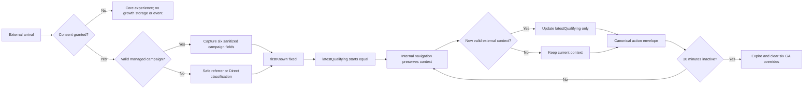
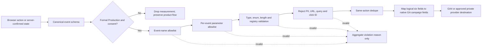
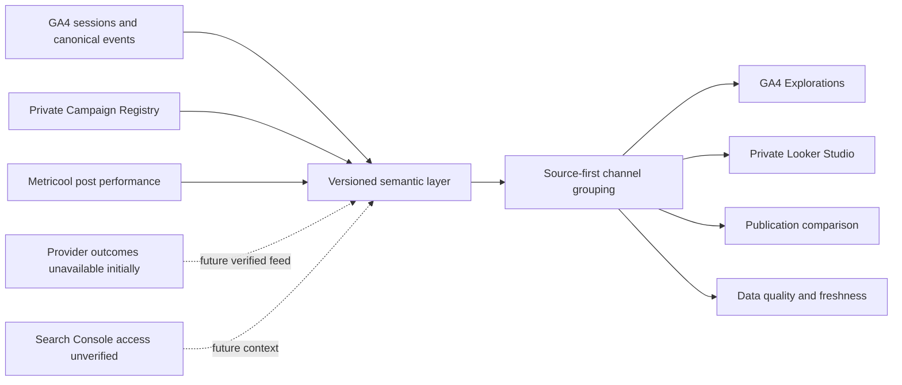
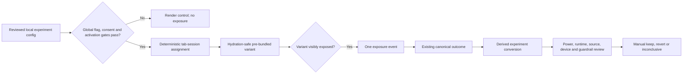
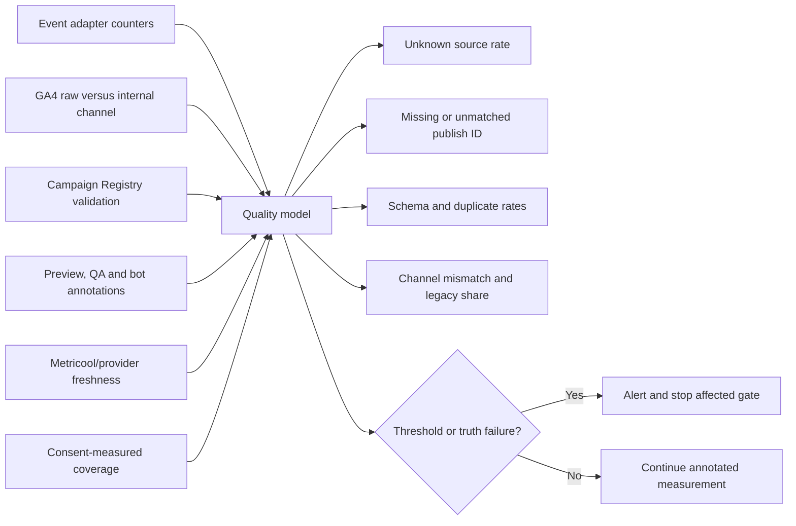

# First China Trip Kit V3 Phase 4B — Growth Optimization Platform Architecture

Document status: architecture-only candidate for independent review

Architecture branch: `feat/v3-phase4b-growth-platform-architecture`

Audit date: 2026-07-20 (Asia/Shanghai)

No application code, Preview or Production deployment is authorized by this document.

## 1. Executive summary

First China Trip Kit already has the beginnings of a measurable acquisition
system: three Phase 4A social Landings, GA4, Metricool, Newsletter/Brevo,
Payhip links, affiliate links, Payment and Visa Hubs, and many custom events.
The missing layer is not another public product. It is a small, governed contract
that makes the existing commercial funnel trustworthy.

The audit found four structural problems:

1. Campaign context is stored as one unvalidated, tab-scoped UTM object and is
   not consistently used by Landing events.
2. Parallel event names cause one Newsletter, paid-Guide, affiliate or Visa
   action to be counted more than once.
3. Clicks exist, but Payhip orders/refunds/revenue and affiliate conversions/
   commissions are not connected. They cannot be inferred.
4. GA4, Metricool and campaign storage currently start without an explicit
   consent gate, and complete URLs can carry query values into analytics.

The recommended architecture is conservative and publication-aware:

```text
publication identity in utm_id / publishId
+ GA4 session acquisition and canonical website events
+ consent-aware tab session context for internal navigation
+ private Campaign Registry linking publishId to Metricool publication records
+ provider-confirmed commerce outcomes only after a verified integration
```

For the first Phase 4B implementation, use **Hybrid-light**: GA4 Explorations
and a private Looker Studio website-funnel report, the private Campaign Registry
for publication joins, and Metricool as the separate social-performance source.
This is a deliberately small form of Option C; it does not copy social identities
or create a public/custom dashboard. Provider outcomes join only after a reviewed,
transaction-backed source exists. Until then, those cells are unavailable rather
than zero or estimated.

The recommended attribution model is **publication identity plus session-level
Landing attribution with first-known and latest-qualifying context**. A validated
`utm_id` identifies one separately scheduled publication; `utm_content` identifies
the creative/version; `utm_campaign` identifies the stable initiative. The
session context is stored only after the approved consent decision and expires
after 30 minutes of inactivity. A same-tab context can survive refresh, while
explicit clone/restore guards prevent an active copied tab from silently sharing
attribution. It creates no persistent user ID, fingerprint or cross-device profile.

Experiments remain disabled until the consent/data contract is implemented and
two clean weeks establish a baseline. The first permitted experiment is a
low-risk, below-fold CTA wording/order test with one primary metric, guardrails,
a manual decision and a control kill switch.

Architecture recommendation: **PROCEED TO INDEPENDENT ARCHITECTURE REVIEW**.
Runtime implementation is conditional on the consent posture, GA4 administrative
access and provider-outcome access listed in Section 37.

## 2. Confirmed Phase 4A baseline

The accepted baseline supplied for this task is:

| Item | Accepted value |
| --- | --- |
| Phase 4A application merge | `a74abdcc18eeaeb387901836f25eeade64f19cae` |
| Phase 4A acceptance evidence | `66ed82edcf3eca9a39a1f7b6894572394f75a019` |
| Production deployment | Accepted Phase 4A deployment; provider deployment identifier intentionally omitted from this architecture document |
| Production domain | `https://www.firstchinatripkit.com` |
| Phase 4A acquisition routes | `/landing/pay-in-china`, `/landing/china-visa-free`, `/landing/china-checklist` |

Phase 4A is treated as merged, deployed and accepted. This architecture task
does not repeat that release, change the accepted Landings, schedule social
content or touch Production.

## 3. Repository starting SHA

The architecture branch was originally created from `main` at:

```text
66ed82edcf3eca9a39a1f7b6894572394f75a019
```

The complete-architecture pass starts from the reviewed Campaign Naming commit:

```text
9854a02154f6aa7246ac1ab2f454e6d8b4f3d0c1
```

This contains the frozen publication-level Campaign Naming Standard. The branch
is:

```text
feat/v3-phase4b-growth-platform-architecture
```

Only the four required architecture documents are in scope across Phase 4B; this
pass changes only this total architecture report. No proof-of-concept application
file is required because the code and connected systems supplied enough evidence
to resolve the architecture.

## 4. Current analytics inventory

| Layer | Current location | What works | Main limitation |
| --- | --- | --- | --- |
| Generic event dispatcher | `lib/analytics.ts` | Sends to `gtag` or `dataLayer` | Arbitrary names/parameters; no global sanitizer, dedupe or destination gate |
| GA4 loader | `components/GoogleAnalytics.tsx` | Loads in Vercel Production when configured | No consent gate; Admin configuration and report access unverified |
| SPA page views | `components/GoogleAnalyticsPageView.tsx` | Tracks client path changes | Sends complete location; possible interaction with automatic/history page views |
| Metricool tracker | `components/MetricoolAnalytics.tsx` | Loads in Production; connected brand returns real data | Separate page tracker only; no custom-funnel contract and no consent gate |
| UTM capture | `lib/utm.ts`, `components/AttributionCapture.tsx` | Carries a UTM object across same-tab navigation | Latest partial raw UTM only; no schema, expiry, referral or first/latest split |
| Landing analytics | `lib/landing/analytics.ts`, `components/landing/*` | Local event and parameter allowlist | Reads current URL source rather than canonical stored context |
| Visa analytics | `lib/visa/analytics.ts`, `components/visa/*` | Strong sensitive-parameter exclusion | Multiple compatibility names describe the same interaction |
| Newsletter | `components/NewsletterForm.tsx`, `/api/newsletter`, `lib/services/newsletter.ts` | API success is required before browser success event | Two success names; server/provider status is not a unified reporting fact |
| Product tracking | `components/ProductActionButton.tsx` | Tracks Payhip outbound click | Four aliases and occasional double-send; no verified order feed |
| Affiliate tracking | `components/AffiliateLink.tsx` | Tracks outbound partner click | Klook double-send; full URLs; no provider outcome feed |

Production gating at the loader level is a useful baseline. It is not sufficient
as a system-wide guarantee: event producers are environment-agnostic, and
consent, hostname, schema and deduplication must be enforced by one growth
adapter before data leaves the page.

Detailed evidence is in
`docs/V3_PHASE_4B_CURRENT_EVENT_INVENTORY.md`.

## 5. Current event inventory

The current system contains many useful interaction signals, but several groups
represent one business action under multiple names:

| Business action | Current names | Current quality |
| --- | --- | --- |
| Landing CTA | `landing_hub_clicked`, `landing_cta_clicked` | Role/position inferred from CTA strings |
| Newsletter success | `landing_newsletter_signup`, `newsletter_subscribed` | Same API success under two names |
| Checklist | `checklist_opened`, `checklist_download_clicked`, declared-only `landing_checklist_download`, broad `visa_checklist_saved` | No reliable delivery completion |
| Paid Guide click | `payment_apps_guide_buy_clicked`, `payment_guide_buy_clicked`, `guide_buy_clicked`, `guide_paid_cta_clicked` | One click can send two aliases |
| Affiliate click | `affiliate_click`, `affiliate_klook_clicked` | Klook click can double-send |
| Visa checker start | `visa_checker_started`, `visa_route_screen_started` | Same action double-sent |
| Visa checker result | `visa_checker_completed`, `visa_route_screen_completed`, `visa_checker_result_viewed` | One result produces three events |

Payment/Visa tool events are engagement, not leads or commercial outcomes.
The public paid-product thank-you page event is not proof of an order. There is
no transaction-backed `purchase`, `refund`, revenue or affiliate commission
event in the repository.

Parameter concepts also diverge (`traffic_source`/`utm_source`/`source`,
`placement`/`link_position`, `destination_url`/`destination`, and four product
keys). Phase 4B must reduce these to one allowlisted dictionary.

## 6. Current UTM behavior

Current behavior in `lib/utm.ts`:

- accepts `utm_source`, `utm_medium`, `utm_campaign` and `utm_content`;
- omits both `utm_id` and `utm_term`;
- writes immediately to `sessionStorage` on a layout mount;
- overwrites the entire stored object when any UTM appears;
- blanks missing fields during a partial overwrite;
- trims but does not normalize, validate or cap values consistently;
- stores no schema version, timestamps, expiry, entry Landing or referrer class;
- does not distinguish first-known from latest-qualifying context;
- is normally scoped to the tab's browsing context but can be initially cloned
  through an opener or restored by the browser; it has no clone guard or
  30-minute inactivity rule;
- is not consulted by Landing source attribution;
- has no consent, internal-host, bot or internal-team behavior.

The same campaign currently appears with `social`, `video`, `organic_social`,
`organic_video` and `organic` media in different assets. The present storage
must therefore be treated as legacy latest-partial attribution, not a reliable
first-attribution implementation.

## 7. Current Newsletter flow

```text
User submits form
→ client reads stored UTM object
→ POST /api/newsletter
→ server validates length and consent-adjacent payload
→ Supabase/Brevo attempt
→ API returns provider/delivery status
→ client emits a success alias after HTTP success
→ client opens /thank-you
```

Positive behavior: a success event is not emitted before the API succeeds.

Gaps:

- no canonical `newsletter_started`;
- two completion aliases;
- browser ignores returned provider/delivery status;
- Supabase and Brevo retain different fields;
- inputs do not use the shared UTM taxonomy;
- application success can mean saved even if Brevo delivery is unavailable;
- actual welcome automation/contact reporting remains unverified in this task;
- there is no server analytics sink, and email must never become an analytics
  join key.

The future `newsletter_completed` definition is “the approved server-side
subscription success state was returned,” not “welcome email delivered.”

## 8. Current Checklist flow

The Checklist has several entry and click events but no single delivery fact.
`/thank-you` is directly accessible. One `checklist_download_clicked` occurs on
the actual PDF link, while another occurs merely when a Guide opens the
thank-you route. The Payment Hub can expose a PDF without a dedicated event.
Visa save/copy/print/download/navigation all use `visa_checklist_saved`.

The future business definition is deliberately narrower:

```text
checklist_delivery_completed
= a measured session reaches an application-confirmed resource delivery state
  and a valid resource is made available
```

It does not claim the browser completed a file transfer. If the application
cannot distinguish this state honestly, the KPI remains unavailable. Page views
and CTA clicks must not be backfilled as delivery.

The locked commercial funnel is a business progression model, not a claim that
every current route is a strict linear sequence. The current Checklist Landing
submits the Newsletter form before presenting the resource. Reports therefore
measure Newsletter and Checklist as separately defined Tier 2 states and do not
force or invent an absent step.

## 9. Current paid-Guide tracking

The shared product button sends outbound click intent and may append Payhip-side
UTMs. Homepage, Hub and Guide call sites add aliases, so a single activation can
generate multiple events. The current `price: "7"` parameter is a listed price,
not revenue and must never be summed.

The public product success route can be opened without provider order proof.
No Payhip webhook, order import, refund import or transaction store exists.

Safe current statement:

```text
Paid-Guide outbound click intent is partially measurable.
Confirmed order, refund and verified revenue are unavailable in-site.
```

## 10. Current affiliate tracking

The generic affiliate link emits `affiliate_click`; Klook may emit that event
and `affiliate_klook_clicked` for one activation. Parameter names differ and
complete page/destination URLs can include query or affiliate values. Inbound
campaign context is not consistently attached.

Only active, valid configured offers render, which is good fail-closed behavior.
Production currently has a Klook path configured; other provider status evidence
is not current enough to treat as active. There is no connected source for
network-recorded conversion, approved commission or paid commission.

Safe current statement:

```text
Affiliate outbound click intent is measurable after deduplication.
Provider conversion and commission are unavailable or unverified.
```

## 11. Real data-source availability

| Source | Classification | Available fact | Missing fact |
| --- | --- | --- | --- |
| GA4 | Partially available; reporting UI/API unverified; delayed | Production collection and website events | Connected reporting API, Admin/channel settings, verified commerce and publication-level reconciliation |
| Metricool | Read-only connected data available; delayed/platform-dependent; current publication-limit error | Planner records expose ID/UUID/status/date/network; network connectors expose differing post/video/pin IDs and performance; Pinterest exposes outbound clicks | Uniform click/post-ID fields, canonical website funnel, Newsletter, orders, commission; TikTok post catalogue did not expose click or stable post ID in this audit |
| Private Campaign Registry | Architecture contract only; not yet implemented | Frozen `publishId`, campaign/content/source/medium, lineage/lifecycle schema | Actual publication records and verified one-to-one Metricool joins |
| Newsletter/Brevo/Supabase | Partially available; reporting access unverified | Application integration and provider/storage attempts | Unified readable lead/delivery source and normalized campaign data |
| Payhip | Click and public product/checkout page available; provider report/export access unverified; automation unconnected | Product/checkout and outbound intent | Checkout reached, order, refund, revenue in-site |
| Affiliate | Click available; provider outcomes unverified/manual | Outbound intent | Network conversion, approved/paid commission |
| Search Console | Unverified / UI or credentials required | Repository setup guidance only | Confirmed property/report access |
| Vercel Analytics | Not available | Deployment platform only | Analytics/Speed Insights dataset |
| Application events | Available now; partial/inconsistent | Engagement, some lead and intent proxies | Global contract, dedupe and verified outcome |
| Existing exports | Partial planning artifacts only | UTM link CSV and blank weekly template | Filled historical normalized report |

Metricool uses `Asia/Shanghai` and returned non-empty Website/social results.
Website reporting exposed Source + Sessions and Page URL + Views, not canonical
funnel actions. Social connector granularity differs by platform; a Pinterest
outbound-click field does not justify assuming all platforms expose clicks. The
existing real posts still use legacy `social`/`video` media and have no `utm_id`,
so they cannot be backfilled into publication joins. Current account operations
also returned a publication-quantity-limit error, which blocks assuming the
Planner can schedule validation posts. Metricool is the publishing/social source,
never the website-conversion truth or `S_L` denominator.

The complete matrix and official-source links are in
`docs/V3_PHASE_4B_DATA_SOURCE_MATRIX.md`.

## 12. Attribution model

### 12.1 Four distinct attribution scopes

Phase 4B deliberately separates identity scopes instead of inventing one
long-lived visitor identity:

| Scope | Stable key / fact | Purpose | Lifetime |
| --- | --- | --- | --- |
| Publication | Public-safe `utm_id` / private `publishId` | One separately scheduled post or placement | Immutable and never reused |
| Creative | `utm_content` | Creative, hook and version reused only when unchanged | Versioned when creative/CTA/destination meaning changes |
| Campaign | `utm_campaign` | Stable commercial initiative across publications | Stable until the objective materially changes |
| Website session | GA4 session acquisition plus a local logical context | Landing-to-Hub and downstream attribution | One consented tab context; 30-minute inactivity expiry |

`utm_source` and `utm_medium` identify the real platform/medium. Publication
identity does not become a user identity: it describes a public marketing item,
not the person who clicked it.

The frozen private registry contract is owned by
`docs/V3_PHASE_4B_CAMPAIGN_NAMING_STANDARD.md`. Its minimum logical shape is:

```ts
type CampaignPublication = {
  campaignId: string;                 // exact utm_campaign
  publishId: PublishId;               // exact public utm_id
  publicationKind:
    | "original" | "exact_repost" | "edited_repost" | "cross_post"
    | "platform_adaptation" | "paid_amplification"
    | "evergreen_resurface" | "correction";
  parentPublishId: PublishId | null;
  supersedesPublishId: PublishId | null;
  landing: LandingName;
  source: CampaignSource;
  medium: CampaignMedium;
  content: string;
  term: string | null;
  metricoolPostId: string | null;
  status: "draft" | "scheduled" | "published" | "cancelled" | "superseded";
  scheduledAt: string | null;
  publishedAt: string | null;
  publicPostUrl: string | null;
  operatorNotes?: string;
};
```

The registry is a reviewed **private build/operator artifact**. It must not be
imported into a public client bundle, serialized into page props, exposed through
an unauthenticated route, or copied wholesale to GA4/Looker. Only the validated,
non-personal `publishId` may appear publicly as `utm_id`. Metricool IDs, lineage,
notes and lifecycle metadata remain private. The frozen uniqueness, lineage,
supersession and status-transition rules are normative and are not duplicated
with a looser implementation schema here.

### 12.2 Logical website session

Phase 4B promises session attribution only, not lifetime visitor attribution:

```text
logical growth session = one versioned browsing context
                         ending after 30 minutes of inactivity
```

GA4 session acquisition remains the reporting fact. A small, consent-aware
context carries sanitized campaign meaning across internal navigation and into
canonical events. It does not create or send a custom session/user ID.

```ts
type GrowthSessionContext = {
  version: 2;
  contextId: string;
  startedAt: number;
  lastActivityAt: number;
  entryLanding: LandingName | null;
  firstKnown: CampaignContext;
  latestQualifying: CampaignContext;
};

type CampaignContext = {
  trafficSource: CampaignSource;
  trafficMedium: CampaignMedium;
  campaignName: string | null;
  publishId: PublishId | null;
  contentGroup: string | null;
  campaignTerm: string | null;
  capturedAt: number;
};
```

Do not store complete URL, click ID, referrer path/query, IP, free text,
nationality, Visa answer, itinerary, email, form value, payment information,
provider customer ID or social account ID. `contextId` is a random local
clone/restore guard; it is never sent to GA4, Metricool, a provider or a report.

### 12.3 Closed six-field mapping

| Valid UTM | Session field | Canonical logical field | GA4 native configuration field | Rule |
| --- | --- | --- | --- | --- |
| `utm_source` | `trafficSource` | `traffic_source` | `campaign_source` | Required on every managed publication |
| `utm_medium` | `trafficMedium` | `traffic_medium` | `campaign_medium` | Required on every managed publication |
| `utm_campaign` | `campaignName` | `campaign_name` | `campaign_name` | Required on every managed publication |
| `utm_content` | `contentGroup` | `content_group` | `campaign_content` | Required on every managed publication; never GA site-content `content_group` |
| `utm_id` | `publishId` | `publish_id` | `campaign_id` | Required, registry-issued, immutable and unique per publication |
| `utm_term` | `campaignTerm` | `campaign_term` | `campaign_term` | Optional controlled manual paid-search group only |
| none | `capturedAt` | none | none | Local expiry/reconciliation only; never sent |
| none | `contextId` | none | none | Local tab-clone guard only; never sent |

The six canonical campaign fields are a logical envelope, not six GA4 custom
parameters. The destination adapter removes them from the custom payload and
uses the native `campaign_*` configuration above. Event-specific fields such as
`landing_name` and `cta_name` remain approved custom parameters.

Every context transition performs a **complete six-field atomic destination
update**. Omitted keys and GA4 SPA `update: true` merging may not be used to
clear prior values. Internally, absent fields and Direct use a typed `CLEAR`
sentinel. 4B.2 must prove the GA-supported clear representation, or an isolated
event-scoped alternative, before runtime acceptance. The sentinel is never
stored or emitted literally. Campaign A → B replaces all six fields, including
`campaign_id`; Campaign → 30-minute idle → Direct clears all six before the
new context's first page view/action. Any stale publication/campaign value is a
release blocker.

### 12.4 Capture precedence, first and latest

1. A complete valid managed set (`source`, `medium`, `campaign`, `content`,
   `id`, plus optional `term`) on an approved Landing.
2. A known external referrer host mapped by source first. Approved social/video
   may become that platform plus `organic`, without a fabricated campaign or
   publication ID. Ordinary untagged Google/Bing search is deliberately
   different: it creates no manual campaign fields, resolves to the internal
   `other` fallback and carries the reporting-derived diagnostic reason
   `unmanaged_organic_search`. The sanitized search-engine origin remains
   available to GA4's raw referrer classification, so Default Channel Group can
   still report `Organic Search` without the application pretending that a
   referrer was an operator-authored UTM.
3. Another external hostname reduced to `referral/referral`, never its path/query.
4. No external evidence becomes `direct/direct`.

Malformed/partial managed parameters fail closed. The aggregate violation count
may increase, but the raw value is not stored, logged or emitted. An operator
typo is rejected, not silently rewritten to `other`; `other` is a reporting
classifier for genuinely unknown inbound evidence.

- `firstKnown` is the first valid context in the measured logical session and
  never changes. Initial consented GA4 configuration and the Landing-session KPI
  denominator use it.
- `latestQualifying` starts with `firstKnown` and changes only when a new valid
  external campaign/referral enters within the active logical session.
- Later canonical actions use `latestQualifying` (or `firstKnown` when no later
  qualifier exists) for event-scoped diagnostics. It must not rewrite GA4's
  session-scoped acquisition denominator.
- Publication reports use GA4 session manual Campaign ID for acquisition and
  event manual Campaign ID for explicitly labelled latest-context analysis. They
  never infer a post from source/content/timestamp when `publish_id` is missing.
- Direct/internal navigation never overwrites a known qualifying context;
  internal links never carry UTMs or click IDs.
- No duplicate first/latest custom-field set or user property is emitted merely
  to force a join.

### 12.5 Lifecycle, tabs and fallback

- Thirty minutes of inactivity creates a new logical context. No lifetime first
  touch persists across expired visits.
- `lastActivityAt` updates on a visible route transition, canonical action, or a
  throttled visible `pointerdown`, `keydown` or `scroll` (at most once per 60
  seconds). Hidden/background time does not renew a context.
- `sessionStorage` can be cloned through `window.opener` or restored. Managed new
  windows use `rel=noopener`; a `BroadcastChannel` collision handshake makes the
  newer active tab discard a copied `contextId`. Without BroadcastChannel, a
  non-null opener or fresh `navigate` document with a pre-existing record resets
  conservatively; `reload` may retain a still-valid record.
- A restored tab continues only while `lastActivityAt` is within 30 minutes.
- If `sessionStorage` is unavailable or throws, keep a memory-only context for
  the current document, send no persistent experiment assignment, preserve core
  function and mark attribution coverage degraded. Never fall back to a hidden
  long-lived cookie, URL propagation or server fingerprint.

### 12.6 Consent, click IDs, bots and internal traffic

Until approved analytics consent exists, do not persist campaign context or
experiment assignment and do not send growth events. Do not backfill pre-consent
activity. Essential navigation, Newsletter, Checklist and checkout still work;
experiments render control.

`gclid`, `fbclid` and `ttclid` are vendor-generated inbound click identifiers,
not campaign/publication IDs. The campaign builder never creates them. An owned
redirect and the Landing preserve an inbound value byte-for-byte until the
approved consent-aware vendor tag has had its opportunity to read it. They never
enter sessionStorage, canonical event payloads, the Campaign Registry,
Newsletter fields, internal/outbound links, sitemap/canonical URLs or dashboard
dimensions. The initial architecture performs no address-bar cleanup. Any later
cleanup requires vendor-specific network, redirect and consent validation.
Google Ads auto-tagging (`gclid`, no manually authored UTM set) remains separate
from the manual publication URL mode; do not silently combine the two.

Apply the same formal Production-host check at the event adapter. Exclude
Preview, localhost and known QA paths before collection. Put GA4 internal-traffic
filters in Testing before activation. Use provider/GA bot filtering and aggregate
anomaly thresholds rather than fingerprinting or IP-based identity.

## 13. UTM governance

All new managed publication URLs use the frozen six-field schema and detailed
rules in `docs/V3_PHASE_4B_CAMPAIGN_NAMING_STANDARD.md`:

```text
utm_source + utm_medium + utm_campaign + utm_content + utm_id
+ optional controlled paid-search utm_term
```

`utm_campaign` is the stable initiative, `utm_content` the creative/version and
`utm_id` the immutable publication. Every separately scheduled publication,
including exact reposts and cross-posts, receives a new registry-issued
`publishId`; unchanged creative may reuse `utm_content`. Corrected/superseded IDs
are never recycled. Historical rows without `utm_id` remain legacy and must not
be fabricated into publication-level data.

Canonical source allowlist:

```text
google bing tiktok instagram threads bluesky pinterest reddit quora
youtube twitch facebook newsletter direct referral other
```

Canonical medium allowlist:

```text
organic paid_social paid_video cpc email referral direct affiliate other
```

`direct`, `referral` and `other` are classifier outputs, not normal Metricool
inputs. New unpaid posts use `organic`; historical `social`, `video`,
`organic_social` and `organic_video` map to displayed `organic` with a legacy
quality flag. Manual paid search uses `cpc`; ordinary organic search is not
manually tagged. Historical raw data is not rewritten.

Because GA4 Default Channel Group classifies an unrecognized source with medium
`organic` as Organic Search, the versioned semantic layer applies these
source-first groups in order:

| Internal group | Closed rule |
| --- | --- |
| `paid_search` | `google|bing + cpc` |
| `email` | `newsletter + email` |
| `paid_video` | `tiktok|youtube|twitch + paid_video` |
| `paid_social` | approved social/community source + `paid_social` |
| `organic_video` | `tiktok|youtube|twitch + organic` |
| `organic_social` | approved social/community source + `organic` |
| `affiliate` | approved outbound/provider aggregate + `affiliate` only in its separate contract |
| `referral` | safe classified external referral + `referral` |
| `direct` | no qualifying campaign/referrer + `direct` |
| `other` | unknown inbound source or incompatible source/medium pair |

GA4 Default Channel Group remains visible as a diagnostic. Dashboard reporting
uses the internal group and a matching GA4 Custom Channel Group. Changing the
GA4 Primary Channel Group is optional, requires Admin/report reconciliation and
must not precede a reviewed Custom group. Every approved source needs a formal
Production-host test of source, medium, `utm_id`/Campaign ID, raw GA4 channel and
expected internal group before scheduling. Any raw/internal mismatch produces a
quality record and alert; it is never silently rewritten. Historical media are
normalized only in the semantic layer, never by rewriting GA4 history.

One taxonomy boundary is intentional in this frozen version: an ordinary
untagged Google/Bing search has no controlled operator source/medium pair, so
the internal resolver returns `other` with the non-attribution diagnostic reason
`unmanaged_organic_search`. It does **not** author `google|bing + organic`, and it
does not copy GA4's raw `Organic Search` label into the controlled internal
group. The report retains raw Default Channel Group for search analysis, while
Google Search Console remains the separate source of search-discovery truth.
Adding a dedicated internal organic-search group is a later taxonomy review,
not an implicit Phase 4B rule change.

Values are lowercase ASCII, underscore-separated and non-personal. Source,
medium and `utm_id` are at most 32 characters; campaign/content/term are at most
64. `publishId` is registry-issued and validated exactly, never normalized or
repaired by the builder. Invalid managed values are rejected rather than mapped
to `other`. No public `fctk_campaign`, Metricool ID, audience name, account ID,
caption, click ID or traveller/customer data is allowed.

## 14. Campaign URL contract

Proposed file: `lib/growth/campaign-url.ts`, backed by the existing Landing data
rather than a second route table.

```ts
buildCampaignUrl({
  landing,
  publishId,
  source,
  medium,
  campaign,
  content,
  term,
})
```

Accepted Landings:

```text
pay_in_china      → /landing/pay-in-china
china_visa_free   → /landing/china-visa-free
china_checklist   → /landing/china-checklist
```

Contract:

- force HTTPS and `www.firstchinatripkit.com`;
- reject an unknown Landing, external domain, port, credentials or scheme;
- require one registry-issued unique `publishId` and map it exactly to `utm_id`;
- normalize controlled fields before validation;
- never normalize or repair a non-canonical `publishId`;
- remove all existing `utm_*` values and write one copy in deterministic order:
  source, medium, campaign, content, ID, then optional term;
- reject unapproved unrelated query parameters;
- reject caller-authored `gclid`, `fbclid` and `ttclid`; inbound platform
  decoration is handled only by the consent-aware Landing boundary;
- encode with `URL`/`URLSearchParams`;
- return `{ ok, url/normalized }` or field-level errors;
- reject incompatible source/medium pairs and reporting-only sources;
- never operate on internal links;
- log no URL values that could contain personal data.

Six Metricool-ready examples:

```text
https://www.firstchinatripkit.com/landing/pay-in-china?utm_source=tiktok&utm_medium=organic&utm_campaign=china_first_trip_launch&utm_content=payment_short_credit_card_hook_01&utm_id=fctk_2026_000121

https://www.firstchinatripkit.com/landing/china-checklist?utm_source=pinterest&utm_medium=organic&utm_campaign=china_first_trip_launch&utm_content=checklist_pin_preflight_01&utm_id=fctk_2026_000122

https://www.firstchinatripkit.com/landing/china-checklist?utm_source=instagram&utm_medium=organic&utm_campaign=china_first_trip_launch&utm_content=checklist_carousel_arrival_ready_01&utm_id=fctk_2026_000123

https://www.firstchinatripkit.com/landing/pay-in-china?utm_source=threads&utm_medium=organic&utm_campaign=china_first_trip_launch&utm_content=payment_text_backup_layers_01&utm_id=fctk_2026_000124

https://www.firstchinatripkit.com/landing/china-visa-free?utm_source=reddit&utm_medium=organic&utm_campaign=china_first_trip_launch&utm_content=visa_transit_answer_third_country_01&utm_id=fctk_2026_000125

https://www.firstchinatripkit.com/landing/china-visa-free?utm_source=youtube&utm_medium=organic&utm_campaign=china_first_trip_launch&utm_content=visa_transit_short_route_check_01&utm_id=fctk_2026_000126
```

The exact frozen examples use distinct IDs `fctk_2026_000121` through
`fctk_2026_000126`. Implementation snapshots must match these complete URLs and
the Campaign Naming Standard byte-for-byte.

Unit tests cover normalization, publication-ID uniqueness/immutability,
lineage/status validity, PII-like values, duplicate parameters, encoding,
canonical-domain enforcement, invalid source/medium pairs, click-ID rejection,
source-first classification, mismatch alerts and all six exact frozen examples.

## 15. Event taxonomy

### 15.1 Canonical contract

For every measured growth event, the phrase “campaign fields” means exactly:

```text
Required: traffic_source, traffic_medium
Conditionally required for managed publication context:
          campaign_name, content_group, publish_id
Optional: campaign_term
```

Optional campaign fields are omitted, never filled with raw `(not set)` text.
The conditional fields are absent for Direct/referrer-derived contexts and
mandatory together for managed publication context. They come only from the
valid six-field mapping in Section 12. `publish_id` is public-safe campaign
metadata, never a person/session ID. No other UTM/session field is eligible.

| Event | Business meaning and trigger | Source of truth / destination | Required logical envelope fields | Optional logical envelope fields | Forbidden data | Dedupe | Tier / execution | Existing alias and migration |
| --- | --- | --- | --- | --- | --- | --- | --- | --- |
| `landing_view` | Approved Landing is visibly rendered in a measured Production context | Client render → GA4; KPI uses distinct session | `landing_name`, `traffic_source`, `traffic_medium` | `campaign_name`, `content_group`, `publish_id`, `campaign_term` | URL/query, identity | Once per page lifecycle; report by session | Tier 1 Engagement / client | Keep name; replace current-source resolver |
| `landing_primary_cta_clicked` | Designated primary CTA receives one genuine activation | Client → GA4 | `landing_name`, `cta_name`, `destination_type`, `traffic_source`, `traffic_medium` | `campaign_name`, `content_group`, `publish_id`, `campaign_term`, `cta_position` | Destination URL, free text | One per DOM activation; short duplicate-handler guard | Tier 1 Engagement / client | Map role-specific `landing_hub_clicked`/`landing_cta_clicked` |
| `landing_secondary_cta_clicked` | Designated secondary CTA receives one genuine activation | Client → GA4 | `landing_name`, `cta_name`, `destination_type`, `traffic_source`, `traffic_medium` | `campaign_name`, `content_group`, `publish_id`, `campaign_term`, `cta_position` | Destination URL, free text, identity | One per DOM activation; short duplicate-handler guard | Tier 1 Engagement / client | Map role-specific aliases |
| `hub_view_from_landing` | Same measured Landing session reaches that Landing's intended Hub | Derived from `landing_view` + sanitized `page_view`; no new browser event | `landing_name`, `destination_type`, `page_path` in the reporting model | `traffic_source`, `traffic_medium`, `campaign_name`, `content_group`, `publish_id`, `campaign_term` | Identity, query or raw URL | One per session/Hub pair | Tier 1 Engagement / reporting-derived | Replaces click-as-progression assumptions |
| `newsletter_started` | First meaningful field interaction or first submit attempt | Client → GA4 | `interaction_type=start`, `traffic_source`, `traffic_medium` | `landing_name`, `campaign_name`, `content_group`, `publish_id`, `campaign_term` | Email/value, validation text | Once per form/session | Tier 1 Engagement / client | New |
| `newsletter_completed` | Approved API success state returned | Server response determines success; consented client sends once to GA4 | `interaction_type=completed`, `traffic_source`, `traffic_medium` | `landing_name`, `campaign_name`, `content_group`, `publish_id`, `campaign_term` | Email, provider/contact/delivery status, error text | Once per successful form/session | Tier 2 Lead / server-confirmed client | Replace both Newsletter success aliases |
| `checklist_delivery_completed` | Valid Checklist delivery state is presented after the approved flow | Client delivery component after the approved server flow → GA4 | `destination_type=checklist`, `traffic_source`, `traffic_medium` | `landing_name`, `campaign_name`, `content_group`, `publish_id`, `campaign_term` | Email, file URL/token | One consumed logical-session delivery flag | Tier 2 Lead / client from server-confirmed flow | Do not map old clicks/page views as completion |
| `paid_guide_clicked` | One outbound activation to a verified configured paid-Guide destination | Client → GA4; Payhip remains order truth | `product_id`, `destination_type=payhip`, `traffic_source`, `traffic_medium` | `landing_name`, `campaign_name`, `content_group`, `publish_id`, `campaign_term`, `cta_name`, `cta_position` | Full URL, listed price as revenue, customer data | One event per activation; no aliases | Tier 3 Commercial intent / client | Replace four paid click names |
| `affiliate_link_clicked` | One outbound activation to an enabled affiliate destination | Client → GA4; network remains conversion truth | `partner_name`, `destination_type=affiliate`, `traffic_source`, `traffic_medium` | `landing_name`, `campaign_name`, `content_group`, `publish_id`, `campaign_term`, `cta_name`, `cta_position` | Full URL, affiliate token, customer data | One event per activation | Tier 3 Commercial intent / client | Replace generic + Klook aliases |
| `experiment_exposure` | Assigned variant is actually visible | Client → GA4 after render/visibility | `experiment_id`, `variant_id`, `landing_name`, `traffic_source`, `traffic_medium` | `campaign_name`, `content_group`, `publish_id`, `campaign_term` | Session seed, identity | Once per experiment/session | Experiment control signal / client | New |
| `experiment_conversion` | Exposed session produces the predeclared canonical outcome | Reporting join; do not add another browser action event | `experiment_id`, `variant_id`, `interaction_type` | `landing_name` | Identity, raw event payload | Once per exposure/outcome/session in report | Experiment / derived | New derived record |

Dashboard use is closed: `landing_view` defines qualifying acquisition context;
the two CTA events feed separate CTA rates; `hub_view_from_landing` feeds Hub
progression; Newsletter/Checklist events feed Tier 1/2 rates; paid Guide and
affiliate events feed only Tier 3 intent; exposure plus an existing canonical
outcome feeds an experiment report only after activation. No other current
product event enters a growth KPI merely because it remains observable.

The initial canonical set intentionally excludes `purchase`, `refund` and
revenue because no verified provider feed exists. When a provider outcome is
approved, it enters a separate Tier 4 server/import contract with provider ID
idempotency, product, amount, currency, status and `data_as_of`; it is never
generated from a browser thank-you page. Newsletter provider/delivery status is
also not a GA4 parameter. Brevo/Supabase totals may be reconciled separately in
aggregate, but they cannot be joined to GA4 sessions by email and no new private
Newsletter aggregate store is assumed in Phase 4B.

### 15.2 Foundational page-view schema

`page_view` is an approved analytics infrastructure event, not an additional
funnel conversion. After consent, configure GA4 so automatic/history tracking
does not double-send. Set `send_page_view: false`, apply the current sanitized
campaign context to GA4's native manual-campaign configuration, then emit exactly
one sanitized initial/SPA page view:

| Field | Construction | Constraint |
| --- | --- | --- |
| `page_path` | `window.location.pathname` normalized against an approved internal route/path pattern | Starts with one `/`; maximum 160; no query, hash, credentials, scheme, host, dot-segment or repeated `//` |
| `page_location` | `https://www.firstchinatripkit.com` + validated `page_path` | Generated internally; maximum 220; no query/hash; never accept caller input |
| `page_referrer` | Initial view: approved external origin only; SPA view: canonical site origin; Direct: explicit empty value | Override GA4's raw `document.referrer` default; maximum 160; no path, query, hash, credentials or caller input; never retained in session context/dashboard |

The destination adapter performs the Section 12 mapping before the page view:

```text
trafficSource  -> campaign_source
trafficMedium  -> campaign_medium
campaignName   -> campaign_name
contentGroup   -> campaign_content
publishId      -> campaign_id
campaignTerm   -> campaign_term
```

This preserves approved manual-campaign acquisition while removing the query
from `page_location`. Direct traffic and ordinary untagged search invoke the
verified six-field clear operation rather than merely omitting campaign keys;
the latter supplies only its sanitized search-engine origin as `page_referrer`
so GA4 may retain its raw Organic Search classification. Approved social/video
referral classification uses only the normalized source/medium result from
Section 12, never the raw referrer URL. The internal result for untagged search
is `other` plus the reporting-derived `unmanaged_organic_search` diagnostic, not
fabricated manual `google|bing + organic` campaign fields. Canonical event fields
remain the internal adapter contract; GA4 native manual-campaign dimensions and
the Looker semantic layer use the mapping above. Do not register or send the
creative ID as GA4's unrelated site-content `content_group` parameter.

The adapter also overrides GA4's default `page_referrer`, because its default is
the complete `document.referrer`. Only an allowlisted `https` external origin,
the canonical site origin for an internal transition, or an explicit empty value
is eligible. An invalid/non-HTTPS origin is dropped to the empty value. The
referrer is not copied into campaign storage or the dashboard.

No raw `window.location.href` or `document.referrer` is sent. Hub progression is
derived from this clean `page_path` plus the same GA4 session containing
`landing_view`; `hub_view_from_landing` is never emitted by the browser. Verify
the implementation in GA4 DebugView and Traffic acquisition before accepting
4B.2. If native campaign dimensions do not reconcile with the approved test
matrix, stop the subphase; do not restore a query-bearing `page_location`.

Google Ads auto-tagging/GCLID is outside the manual publication-link builder.
Its consent, redirect and GA4-linking behavior must be tested independently; the
initial implementation does not strip, override or combine it with manual UTMs.

Primary references: [GA4 configuration fields, including manual campaign
overrides](https://developers.google.com/analytics/devguides/collection/ga4/reference/config)
and [GA4 reporting dimensions, including session manual campaign
dimensions](https://developers.google.com/analytics/devguides/reporting/data/v1/api-schema).

### 15.3 Event principles

- Send no extra browser event when a metric can be derived from canonical page
  and action events.
- One physical activation produces one business event.
- Use a global event-name and parameter allowlist; local domain sanitizers may
  further narrow it.
- Sanitize before `gtag`/`dataLayer`, not only inside individual components.
- Production hostname, consent and schema checks fail closed.
- Keep raw legacy aliases in historical reports but never sum them with canonical
  events.
- The global registry has a strict schema per event, including `page_view` and
  domain events that remain outside the growth KPI. There is no arbitrary
  passthrough. Homepage, Contact, Share, Payment and Visa events remain local
  product analytics only after their existing literal names and permitted
  categorical parameters are registered; otherwise the Preview migration fails
  closed. They are not silently promoted into the growth KPI set.

## 16. Parameter dictionary

All strings use lowercase ASCII controlled values unless a policy version uses
the approved date format. Unknown values are dropped with an aggregate schema
violation; raw invalid values are not logged.

| Parameter | Type / allowed values | Maximum / normalization | Invalid or absent fallback | Example | Privacy rationale | GA4 safe | Dashboard safe | Permitted events |
| --- | --- | --- | --- | --- | --- | --- | --- | --- |
| `landing_name` | Three Landing enum values | 32; exact enum | Drop event when required; omit when optional | `pay_in_china` | Public page category | Yes | Yes | Landing, funnel, experiment |
| `traffic_source` | Controlled source enum | 32; normalized only at capture | Safe classifier may return `other`; invalid managed UTM invalidates context, never copies raw value | `tiktok` | Aggregate channel only | Yes — map to native `campaign_source`, not a custom parameter | Yes | Landing, lead, intent, experiment |
| `traffic_medium` | Controlled medium enum including `organic`, `paid_social`, `paid_video`, `cpc`, `email`, `referral`, `direct`, `affiliate`, `other` | 32; exact enum; legacy mapping only in report | Safe classifier may return `other`; invalid managed UTM invalidates context | `organic` | Aggregate channel only | Yes — map to native `campaign_medium`, not a custom parameter | Yes | Same as source |
| `campaign_name` | Registered ASCII token | 64; approved regex and registry | Omit / null outside a managed campaign | `china_first_trip_launch` | Non-personal campaign label | Yes — native configuration only | Yes | Landing, lead, intent, experiment |
| `content_group` | Registered creative/topic ID | 64; approved regex and registry | Omit / null outside managed content | `payment_short_credit_card_hook_01` | Non-personal creative label | Yes — map to native `campaign_content`; never GA site-content `content_group` | Yes | Landing, lead, intent, experiment |
| `publish_id` | Registry-issued publication ID | 32; exact lowercase ASCII `a-z0-9_`; validate but never repair | Omit outside managed context; reject a managed context when absent/unmatched | `fctk_2026_000121` | Identifies public marketing publication, never a person/session | Yes — map to native `campaign_id`, not a custom parameter | Yes through private registry join | Landing, lead, intent, experiment |
| `campaign_term` | Registered controlled paid-search term | 64; approved regex/registry; never raw search query | Omit / null | `china_payment_apps` | Avoids user-entered query/audience detail | Yes — native configuration only | Yes | Landing, lead, intent, experiment |
| `cta_name` | Controlled action enum | 48; exact enum | Drop event when required; no raw label fallback | `open_payment_hub` | Interface action only | Yes | Yes | CTA, paid Guide, affiliate |
| `cta_position` | `hero`, `mid_page`, `hub_preview`, `footer`, `product_card` or registered enum | 24; exact enum | Omit / null | `hero` | Layout category, not selector/text | Yes | Yes | CTA, paid Guide, affiliate |
| `interaction_type` | Controlled action/status enum | 32; exact enum | Drop event when required | `completed` | Behavioral category only | Yes | Yes | Lead, experiment-derived and approved tool events |
| `destination_type` | `payment_hub`, `visa_hub`, `checklist`, `payhip`, `affiliate`, `guide` or registered enum | 32; exact enum | Drop event when required | `payment_hub` | Replaces destination URL | Yes | Yes | CTA, derived Hub, Checklist, intent |
| `product_id` | Approved product enum | 48; registry | Drop event when required | `payment_apps_setup_guide` | Product category only | Yes | Yes | Paid Guide intent; future provider aggregate |
| `partner_name` | Approved provider enum | 32; registry | Drop event when required | `klook` | Provider category only | Yes | Yes | Affiliate intent; future provider aggregate |
| `experiment_id` | Registered experiment ID | 48; registry | Render control and drop experiment event | `pay_landing_cta_copy_01` | No seed or identity | Yes | Yes | Experiment events |
| `variant_id` | `control` or registered variant | 24; registry | Render control; emit only if the control config is valid | `control` | Categorical assignment only | Yes | Yes | Experiment events |
| `result_category` | Existing approved non-sensitive result enum | 48; exact enum | Drop event when required | `likely_240_hour_transit` | Excludes Visa answers | Yes | Yes | Approved Visa events only |
| `policy_version` | Approved public policy version | 16; `yyyy-mm-dd` | Drop event when required | `2025-11-05` | Public metadata only | Yes | Yes | Approved Visa events only |
| `step_number` | Integer within an approved flow range | Numeric range | Drop event when required | `3` | Contains no answer content | Yes | Yes | Approved tool step events only |
| `page_path` | Validated internal pathname | 160; generated/normalized internally | Drop `page_view`; never copy raw input | `/payments-and-apps` | No host, query or hash | Yes | Yes | `page_view`; reporting-derived Hub progression |
| `page_location` | Canonical origin plus validated `page_path` | 220; generated internally | Drop `page_view`; never copy raw input | `https://www.firstchinatripkit.com/payments-and-apps` | No query/hash; not used as a join key | Yes | No — use `page_path` | `page_view` only |
| `page_referrer` | Approved external origin, canonical site origin or empty | 160; internally generated | Empty; never fall back to raw `document.referrer` | `https://www.google.com` | No path/query and not retained | Yes | No | `page_view` only |

Never collect email/name, nationality, passport type/details, dates, origin or
onward route, selected port, permitted area, precise location, payment details,
free text, caller-supplied destination/referrer URLs, any query string, social
identifiers, customer IDs or experiment session seeds. The only URL-shaped
exceptions are internally generated, canonical, query-free `page_location` and
the origin-only/empty `page_referrer` for GA4 `page_view`; the dashboard uses
`page_path` and retains neither URL field. The allowlist applies both to GA4 and
any future dashboard storage.

## 17. KPI formulas

### 17.1 Qualifying Landing-session denominator

Let `S_L` be distinct **measured Production GA4 sessions** whose session entry
Landing is exactly one of the three approved Landing paths after the canonical
data-start date. Formal hostname, consent and QA/internal filters apply. A
`page_view` count is never a substitute for `S_L`.

In GA4, build a session segment using Landing page/path plus hostname and the
`Sessions` metric, then slice with session-scoped manual source/medium/campaign/
Campaign ID. In Looker, use the same GA4 session-scoped dimensions and semantic
definition. If the connector cannot reproduce distinct qualifying sessions,
keep that card in GA4 Exploration or an approved Data API query; do not invent a
custom browser session ID or approximate with page views.

Let `S_L(event)` mean distinct sessions in `S_L` containing at least one valid
canonical event, and `M_L` mean measured managed-publication Landing ingresses
where a complete managed campaign set is expected.

| KPI | Exact formula | Availability / interpretation |
| --- | --- | --- |
| Landing sessions | `count(distinct sessions in S_L)` | Primary denominator, split by Landing/source/internal group/publication |
| Primary CTA rate | `S_L(landing_primary_cta_clicked) ÷ S_L` | One session once despite repeated activation |
| Secondary CTA rate | `S_L(landing_secondary_cta_clicked) ÷ S_L` | Kept separate from Primary; N/A where no designated secondary CTA |
| Hub progression rate | `distinct S_L sessions reaching intended Hub ÷ applicable S_L` | Reporting-derived from sanitized path; Checklist Landing is N/A when no intended Hub |
| Newsletter start rate | `S_L(newsletter_started) ÷ S_L` | No focus/page-load proxy |
| Newsletter completion rate | `S_L(newsletter_completed) ÷ S_L` | Completion means approved API success, not delivery/open |
| Checklist acquisition rate | `S_L(checklist_delivery_completed) ÷ S_L` | Unavailable until delivery state is honest |
| Paid Guide intent rate | `S_L(paid_guide_clicked) ÷ S_L` | Tier 3 intent only |
| Affiliate intent rate | `S_L(affiliate_link_clicked) ÷ S_L` | Tier 3 intent only |
| Verified purchase rate | `provider-confirmed attributable orders ÷ qualifying S_L` | Unavailable until provider truth and approved non-PII join exist |
| Verified revenue | `provider-confirmed gross charged sales - confirmed refunds`, grouped by currency/window | Never merge currencies or call charged sales payout/settled revenue |
| Unknown source rate | `S_L sessions classified other ÷ S_L` | Show affected normalized source class; raw values remain excluded |
| Missing publish ID rate | `consented M_L ingresses with absent/invalid utm_id ÷ all consented M_L ingresses` | Historical pre-contract traffic is reported separately as legacy, not failure |
| Schema violation rate | `rejected measured envelopes ÷ attempted measured envelopes` | Aggregate reason code only; never raw rejected value |
| Duplicate event rate | `suppressed duplicate canonical attempts ÷ valid canonical action attempts` | Diagnostic; KPI numerators remain distinct-session based |
| Unmatched publication rate | `valid publish_id values with no registry match ÷ managed ingresses carrying publish_id` | Tampered/unknown IDs fail attribution and alert |

Also report consent-measured coverage, legacy-medium share, Preview traffic
count, source/channel mismatch rate and unattributed provider orders. Newsletter,
GA4 and provider records are never joined by email. If orders cannot be joined
at session/publication level, show verified provider totals as **unattributed**
rather than fabricating purchase rate.

Provider fee, tax, currency conversion and payout/settlement are separate facts.
Display each only when the provider exposes and reconciles the exact field. Do
not subtract assumed fees, merge currencies or call a charged sale “settled”.

## 18. Conversion tiers

| Tier | Definition | Canonical examples | Must not be called |
| --- | --- | --- | --- |
| Tier 1 — Engagement | User viewed or interacted with content/tool | Landing CTA, Hub progression, Guide/tool open | Lead, sale, revenue |
| Tier 2 — Lead | Approved subscription or resource-delivery success | `newsletter_completed`, `checklist_delivery_completed` | Purchase |
| Tier 3 — Commercial intent | User left toward a paid Guide or affiliate offer | `paid_guide_clicked`, `affiliate_link_clicked` | Order, conversion, commission, revenue |
| Tier 4 — Verified outcome | Provider-confirmed, reconcilable result | Confirmed Payhip order/refund, network-recorded affiliate conversion, approved/paid commission, verified revenue | Estimated or click-derived result |

Every dashboard card includes its tier. A generic card named “Conversions” is
forbidden because it collapses materially different facts.

The provider ladders remain separate. Payhip progresses from paid-Guide CTA
click → checkout reached (only if provider evidence exists) → confirmed order →
refund → verified net revenue. Affiliate progresses from CTA click →
network-recorded conversion → approved commission → paid commission. No state
is promoted from the previous one by assumption, return URL or thank-you page.

## 19. Dashboard options

| Evaluation | Option A — GA4 Explorations + Looker Studio | Option B — lightweight internal dashboard | Option C — Hybrid |
| --- | --- | --- | --- |
| Speed | Fastest; existing GA4 collection | Slow; build auth, data model and UI | Medium; A plus small verified-outcome source |
| Maintenance | Low | Highest | Low/medium depending on import automation |
| Cost | Usually lowest; account/connector limits must be confirmed | Hosting, DB, auth and engineering | Low initially; grows with provider feeds |
| Privacy | Google access/sharing controls; still needs consent | Full responsibility for security/retention | Split responsibility; private outcome layer needed |
| Latency | GA processing delay | Depends on ingestion | Mixed and must display `data_as_of` |
| Usability | Strong for current owner; no new account system | Custom but operational burden | Strong when sources are genuinely available |
| Metricool | Separate report/eligible connector; plan entitlement unverified | Custom API needed | Side-by-side or eligible connector |
| Payhip/affiliate | Click intent only | Still cannot invent provider outcomes | Can add reviewed provider facts |
| Security | Private Google sharing | Requires staff auth and server-only secrets | Private sharing plus minimal protected outcome data |
| Fit now | Necessary reporting base but cannot join publication registry alone | Excessive | **Best as Hybrid-light**: A plus private publication mapping; verified outcomes remain gated |

## 20. Recommended dashboard architecture

### 20.1 Decision

Use **Option C as a Hybrid-light first implementation**, without building a
custom application dashboard:

```text
GA4 Explorations + private Looker Studio
→ website sessions, canonical events, funnel and quality

Private Campaign Registry
→ publishId ↔ Metricool publication record, lineage and lifecycle

Metricool UI / eligible connector
→ social publication performance, reviewed beside the website funnel

Later gated verified provider feed
→ small private outcome table/import only after truth and access are proven
```

Do not create `app/internal/growth-dashboard/` in the initial implementation.
Private Looker sharing through the owner's approved Google access avoids a new
public account/auth system. The private Campaign Registry is not a public/client
data source and contains no customer identity. Metricool's Looker/API entitlement
is unverified, so manual side-by-side review is an approved fallback. If the
registry cannot be connected safely, import only a reviewed minimal aggregate
mapping into the private report; never expose the source artifact.

### 20.2 Required views

1. **Executive overview** — Landing sessions, CTA, Hub, Newsletter, Checklist,
   paid and affiliate intent, verified outcomes only when available, previous
   period and data freshness.
2. **Landing comparison** — the three Landings, funnel rates, content group and
   experiment status.
3. **Source comparison** — TikTok, Pinterest, Reddit, Instagram, Threads,
   YouTube, Google, Newsletter, Direct and Referral; raw GA channel, internal
   source-first group, volume, downstream quality and mismatch alert.
4. **Publication/campaign comparison** — `publish_id`, campaign, content,
   Landing, session/action matrix and privately joined Metricool publication
   status/performance where available.
5. **Funnel** — Landing session → CTA → Hub → Newsletter → Checklist → paid
   Guide → affiliate, with N/A states where a step does not apply.
6. **Data quality** — unknown source, missing/unmatched `publish_id`, legacy
   medium, channel mismatches, schema violations, duplicates, Preview/internal
   traffic, source freshness and unavailable feeds.

Looker calculations use one versioned semantic definition. Metricool social
counts are never divided by GA4 sessions without an explicitly labelled,
aggregate comparison.

## 21. Experiment architecture

### 21.1 Contract and boundaries

Experiments use reviewed local TypeScript configuration, never arbitrary remote
HTML or JavaScript:

```ts
interface LandingExperiment {
  id: string;
  landingName: LandingName;
  status: "draft" | "active" | "paused" | "completed";
  primaryMetric: CanonicalMetric;
  guardrailMetrics: CanonicalMetric[];
  variants: Array<{
    id: string;
    contentKey: string;
  }>;
  allocation: number[];
  startAt?: string;
  endAt?: string;
}
```

`contentKey` selects pre-reviewed content already present in the application.
It cannot contain markup, script, URL, canonical, policy text or user input.

### 21.2 Assignment

- Experiments are globally disabled by default and individually gated by status
  and dates.
- After approved analytics/experiment consent, create a random logical-session
  seed in sessionStorage and deterministically hash
  `experiment_id + session_seed`. It follows the attribution clone/restore guard.
- Never send or persist the seed outside the tab; never use GA client ID,
  fingerprint, IP, email or social identity.
- Without consent or storage, render control and send no experiment event.
- Bots/crawlers always receive control through the normal canonical route.
- Assignment lasts for the active tab session and expires with the growth
  session; no cross-device or lifetime assignment.

### 21.3 Render, cache and hydration

The first test is below the fold. Server output and initial client output render
control-compatible dimensions, then the consented client boundary selects
pre-bundled copy without changing route, canonical or page metadata. Reserve
equal layout space and avoid image-size differences. If a future Hero test is
required, it needs a separate server/cookie/cache and consent design review;
client swapping above the fold is not approved.

### 21.4 Exposure and conversion

- Emit `experiment_exposure` once only when the assigned content is actually
  visible, not merely when assignment code runs.
- Do not emit a second action event named conversion. Derive
  `experiment_conversion` from an exposure plus the predeclared canonical
  outcome in the same measured session.
- One primary metric is locked before activation. Guardrails include at least
  downstream lead quality, accessibility errors, LCP/CLS/INP, source mix and
  device mix.
- Experiment reports include control/variant session volume, freshness,
  consent-measured coverage and exclusions.

### 21.5 First permitted experiment

Phase 4B builds contracts, deterministic assignment and tests, but ships with
**zero active experiments**. Activation is a later manual decision and requires
all of the following:

- one predeclared Primary Metric and named guardrails;
- an observed clean baseline conversion rate for that metric;
- a business-meaningful minimum detectable effect (MDE);
- predeclared alpha and statistical power;
- sample size calculated from baseline, MDE, alpha and power;
- a minimum runtime covering at least two full weekly cycles;
- stable source mix plus separate Mobile/Desktop checks;
- no material missing `publish_id`, schema, duplicate or consent-coverage issue;
- no concurrent change that makes the tested variable indistinguishable.

Only after at least two clean baseline weeks and a viable power plan may the
first candidate be reviewed:

```text
Target: one below-fold CTA wording or benefit-order block on one Landing
Primary metric: Landing primary CTA rate or the single downstream metric
                closest to the changed element (predeclared)
Guardrails: Hub progression, Newsletter completion, accessibility,
            LCP/CLS/INP, source and device mix
```

Do not test the Visa policy conclusion, legal/privacy copy, price truth,
canonical metadata or a misleading CTA. The first test is paused if the Landing
mix changes materially during the window.

### 21.6 Decision safeguards

- Minimum runtime is the preregistered period and includes at least two complete
  weekly cycles; runtime alone never proves adequate sample.
- Sample target comes from the pre-test power calculation using baseline, MDE,
  alpha and power. A fixed threshold such as “500 visits” is forbidden as proof
  of adequacy.
- If the calculated sample is not reached, report **inconclusive** and do not
  select a winner.
- Do not repeatedly peek and stop on a temporary uplift.
- Review source/device mix and Newsletter quality before a manual decision.
- No automatic winner, allocation shift or autonomous deployment.
- A build-time/runtime kill switch returns every visitor to control.

When traffic is too low, prefer larger headline/value-proposition changes,
sequential product iteration and qualitative behavior feedback. Do not claim a
small observed difference is statistically meaningful merely because its arrow
points upward.

## 22. Consent and privacy

### 22.1 Audited current state

- GA4 and Metricool load on Vercel Production without an explicit consent gate.
- A fresh Production browser receives persistent GA first-party analytics
  cookies before any preference choice.
- Raw UTM values are written to `sessionStorage` immediately.
- Experiment assignment is not implemented yet, but the proposed assignment
  would also use optional client storage and therefore shares the consent gate.
- GA4/Metricool page requests and generic product/affiliate events can carry a
  complete URL with query values.
- The current Privacy Policy names GA4, Newsletter/Brevo, Payhip and external
  services, but not Metricool, campaign/experiment storage, retention, analytics
  preference controls or all functional localStorage.
- Visa answers are not persisted or emitted by the Visa sanitizer, which must be
  preserved.

### 22.2 Technical recommendation

Use one globally safe consent posture rather than fragile IP geolocation:

1. Initialize analytics consent as denied before GA configuration.
2. Present equally accessible Accept, Reject and Manage choices where required.
3. In the conservative starting mode, do not load GA4/Metricool or persist
   analytics attribution/experiment assignment until consent is granted.
4. Store the user's preference in the minimum first-party mechanism required to
   remember the choice; document its purpose and lifetime.
5. Provide a permanent “Privacy choices” control to withdraw or change consent.
6. On withdrawal, stop future events and clear optional growth/experiment
   storage; essential functional tools continue to work.
7. Sanitize page paths and campaign values before collection even after consent.

`sessionStorage` is not a cookie, but attribution/experiment use is non-essential
measurement storage in this design. Gate it with the same approved analytics/
experiment choice. If the user rejects or withdraws, keep the site functional,
do not create/update that context, clear optional records and report the visit as
outside measured coverage. The expected attribution gap is preferable to hidden
storage or guessed backfill.

Do not reconstruct or backfill events from activity that occurred before
consent. If consent is granted after internal navigation has already removed the
original acquisition evidence, start a safe current context and mark the earlier
path unmeasured rather than guessing its campaign. Dashboard coverage notes must
make this limitation visible.

Metricool states that its website tracker is cookieless/no unique identifier,
but the audited request still receives the page URL. Its category and any
audience-measurement exemption require project-specific review. Until that
review is complete, gate it with analytics consent as the safest implementation.

For EU/UK-facing traffic, default-denied optional measurement, equal Reject/
Manage access, withdrawal and behavior-matched disclosure are the conservative
technical starting point. Do not use IP geolocation to weaken it. The operating
entity still needs qualified review of lawful basis, consent wording and whether
any provider-specific exception applies.

UTM values may be removed from the address bar only after they have been validly
captured under the approved consent posture and redirect/history behavior has
passed attribution tests. Vendor click IDs are different: preserve an inbound
`gclid`, `fbclid` or `ttclid` until the approved tag can read it; any cleanup is
vendor-specific and must not copy the value to storage, events or internal links.

Google Consent Mode supplies tag behavior, not the user interface. A CMP or
equivalent preference control is still required. Relevant primary/provider
references:

- [Google Consent Mode implementation](https://developers.google.com/tag-platform/security/guides/consent)
- [Metricool website tracker cookie statement](https://help.metricool.com/use-of-cookies-in-metricool-v5dg7)
- [EU online privacy overview](https://europa.eu/youreurope/business/dealing-with-customers/data-protection/online-privacy/index_en.htm)
- [UK ICO cookies and similar technologies guidance](https://ico.org.uk/for-organisations/direct-marketing-and-privacy-and-electronic-communications/guide-to-pecr/cookies-and-similar-technologies/)

### 22.3 Newsletter consent

The free resource action and future marketing subscription should be explicit.
The implementation review must choose either:

- separate free delivery from an optional, unchecked marketing consent; or
- make the primary action unambiguously “Subscribe and get the checklist” with
  the approved notice.

Record the minimum evidence needed for the chosen workflow (notice version,
purpose, timestamp and provider status) server-side. Do not send it to GA4. A
legal reviewer must decide double opt-in and jurisdiction-specific wording.

### 22.4 Required policy updates

Before runtime release, align the Privacy/Cookie notice with actual behavior:

- GA4 and Metricool purposes and processors;
- analytics cookies and campaign/experiment sessionStorage;
- essential functional localStorage and reset controls;
- affiliate click tracking and external checkout;
- consent/withdrawal mechanism;
- retention and data-freshness periods;
- controller contact, applicable rights and cross-border processing language;
- policy effective date and change history.

**This is a technical recommendation, not legal advice.** Final text and
lawful-basis decisions require qualified review for the operating entity and
target regions; nothing here is a legal guarantee.

## 23. Reliability controls

| Failure mode | Required control | Detection / reporting |
| --- | --- | --- |
| Browser refresh | Page lifecycle guard; KPI distinct sessions rather than event count | Events/session and refresh Playwright case |
| Back/Forward | Route-aware capture that preserves active context and does not recapture internal referrer | Navigation integration and Playwright tests |
| Client transitions | Observe pathname/search changes in one growth boundary; validate only approved external context | Landing-to-Hub test |
| Server/client double fire | One canonical client adapter; derived metrics are not browser events | Network/dataLayer count assertion |
| Repeated CTA click | One event per genuine activation; short same-activation guard; KPI session-deduped | Duplicate-event rate |
| Repeated Newsletter attempts | Start once per form/session; complete only once per successful response | API status integration tests |
| Failed Newsletter submission | No completion; categorical operational error outside GA or approved non-sensitive status | 400/409/503 tests and server logs |
| Blocked analytics | Site, form, Checklist and checkout continue normally; data quality shows measured coverage limits | Browser with blocked tracker |
| Preview/localhost | Central hostname and environment gate before destination call | Production smoke plus Preview/local negative tests |
| Internal QA | GA filter in Testing, QA path/content convention and release-window annotation | Data-quality view; never silently delete historical data |
| Bots | Provider bot filters, server logs and anomaly thresholds; no fingerprint/IP profile | Spike/source-quality review |
| Unknown referral | Store only normalized external hostname class; never raw path/query | Unknown/referral rate |
| Malformed UTM | Reject raw value, use safe classifier fallback only, count aggregate violation | Schema-violation metric |
| Missing/invalid `utm_id` | Reject managed publication attribution; do not synthesize ID | Missing publish-ID rate; affected Landing/source class |
| Registry mismatch | Validate `publish_id` against private registry in reporting/build boundary | Unmatched-publication count/rate; block scheduling for authored link |
| Source/medium mismatch | Closed compatibility table; authored mismatch rejected | Schema violation and source-pair alert |
| GA4/internal channel mismatch | Keep raw GA channel; source-first expected group stays versioned | Mismatch count/rate by safe source and `publish_id` |
| Click-ID damage/leakage | Preserve inbound value until approved vendor read; never store/emit/propagate | Redirect/network test; payload/log scan |
| Payhip delay | Display `data_as_of`, source status and unattributed outcomes | Provider reconciliation |
| Affiliate window/status | Preserve pending/approved/rejected/paid separately | Provider report reconciliation |
| Schema error | Central allowlist fails closed; development warning without raw payload | Automated contract tests and quality view |
| Third-party unavailable | Mark N/A/unavailable rather than zero; no retry loop on public rendering | Source-status card |

GA4 initial and SPA page-view behavior must be configured as one intentional
strategy. If a sanitized explicit `page_view` is used, configure initial/history
behavior so Enhanced Measurement does not create a second view.

The minimum data-quality view contains `unknown_source_rate`,
`missing_publish_id_rate`, `legacy_medium_share`, `schema_violation_count`,
`duplicate_event_rate`, `preview_traffic_count`,
`unmatched_publication_count`, raw/internal channel mismatch rate, consent
coverage and each source's `data_as_of`. A delayed or unavailable source renders
that status, never a misleading zero.

## 24. Storage decision

### 24.1 Website attribution alternatives

| Option | Landing → Hub/lead continuity | Lifetime / tab behavior | Privacy and consent | Decision |
| --- | --- | --- | --- | --- |
| Memory only | Lost on reload/full navigation; works inside one mounted document | Shortest; no restore | Lowest persistence, but still do not emit before consent | Runtime fallback only when storage is unavailable |
| `sessionStorage` | Supports same-tab navigation/reload with explicit expiry and clone guard | Tab-oriented but opener clone/browser restore require controls | Non-essential measurement storage; gate after approved consent | **Preferred Phase 4B initial choice** |
| First-party cookie | Supports cross-tab/revisit and server reads | Persistent across visits according to expiry | Higher tracking/consent/retention burden; unnecessary for locked funnel | Reject for initial attribution/experiments |
| No client context, GA4 only | GA session acquisition remains, but application events cannot reliably carry sanitized context after internal navigation | Provider-defined session behavior | Smallest local footprint, still subject to GA consent | Safe rollback/degraded mode, not sufficient for full funnel attribution |

The recommendation is conditional: use versioned `sessionStorage` only after the
approved consent decision and with the 30-minute activity, clone/restore and
unavailable-storage behavior in Section 12. It is not a long-lived visitor
profile. Rejecting analytics yields an explicit measurement gap, not a cookie or
server-identity fallback.

### 24.2 Data-by-purpose decisions

| Need | Smallest approved choice | Rejected/deferred alternatives | Reason |
| --- | --- | --- | --- |
| Session campaign context | Consented, versioned `sessionStorage`; 30-minute inactivity plus clone/restore guard | Persistent attribution cookie, DB, fingerprint | Internal-navigation/refresh continuity without lifetime identity |
| Experiment assignment | Same guarded logical-session context; control without consent | Persistent ID/cookie, remote service | Stable within the logical session and easy rollback |
| Consent preference | Minimum first-party preference storage required by the chosen control | URL/query or server profile | Must remember withdrawal/choice without an account |
| Aggregate dashboard metrics | GA4 + private Looker Studio | Custom DB/dashboard, Vercel Postgres/KV | Existing smallest reporting stack |
| Social performance | Metricool UI/eligible connector, aggregate only | Rebuilt scheduler or copied raw social identities | Metricool already owns this function |
| Publication mapping | Reviewed private Campaign Registry; minimal safe mapping in private Looker only when needed | Public JSON/client bundle, public dashboard route, Metricool ID in UTM | `publishId` is public-safe; provider IDs/lineage remain private |
| Newsletter contacts | Existing Supabase/Brevo operational stores | Copying email into analytics/BI | Preserve existing service and minimize PII spread |
| Verified orders | Initially a reviewed Payhip export if/when report access is verified; later minimal private provider-event table only after approval | Browser thank-you event, listed-price sum | Provider truth and refund reconciliation required |
| Affiliate outcomes | Provider UI/reviewed aggregate CSV until API access is proven | Inferring conversion from clicks | Network statuses and windows are authoritative |
| Historical analytics export | Defer GA4 BigQuery until GA/Looker cannot answer an approved question | Immediate warehouse | Avoid cost and maintenance before need |

If Payhip automation is approved later, reuse a private server-side store such as
the existing Supabase only after schema, retention, access and deletion review.
Store provider event/order ID for idempotency, product/status/amount/currency and
timestamps; strip customer email/name/address from growth reporting. Never expose
service-role, Payhip, Metricool, Brevo, GA or affiliate credentials to the client.

## 25. Metricool integration contract

Metricool remains the publisher and social-performance system. Phase 4B adds a
publication-link operating contract, not a scheduler or website-conversion
source of truth.

| Platform | Source | Unpaid medium / group | Paid medium / group | Example Landing |
| --- | --- | --- | --- | --- |
| TikTok | `tiktok` | `organic` / `organic_video` | `paid_video` / `paid_video` | `pay_in_china` |
| Pinterest | `pinterest` | `organic` / `organic_social` | `paid_social` / `paid_social` | `china_checklist` |
| Reddit | `reddit` | `organic` / `organic_social` | `paid_social` / `paid_social` | `china_visa_free` |
| Instagram | `instagram` | `organic` / `organic_social` | `paid_social` / `paid_social` | `china_checklist` |
| Threads | `threads` | `organic` / `organic_social` | `paid_social` / `paid_social` | `pay_in_china` |
| YouTube | `youtube` | `organic` / `organic_video` | `paid_video` / `paid_video` | `china_visa_free` |
| Bluesky | `bluesky` | `organic` / `organic_social` | `paid_social` / `paid_social` | Landing selected by topic |
| Twitch | `twitch` | `organic` / `organic_video` | `paid_video` / `paid_video` | Landing selected by stream topic |

Operator contract:

```text
Select registered campaign + approved Landing
→ select the creative/version
→ reserve one immutable publishId in the private registry
→ generate and validate canonical campaign URL
→ paste the generated URL into Metricool
→ preview HTTP/canonical/mobile behavior
→ schedule in Metricool
→ attach the Metricool post reference privately to publishId
→ review after each source's freshness window
```

Originals, reposts, cross-posts, paid amplification, phases and evergreen links
follow `docs/V3_PHASE_4B_CAMPAIGN_NAMING_STANDARD.md`. Each platform gets its own
truthful source and unique `utm_id`. Exact cross-post creative may reuse
`utm_content`; an edited creative increments its version. Paid inventory uses
the source-compatible `paid_social` or `paid_video`. Operators do not hand-edit
the generated query.

Read-only Planner records expose ID/UUID/status/date/network, while social
connector identifiers and click metrics vary by platform. Pinterest currently
exposes outbound clicks; TikTok's audited post catalogue did not expose a
comparable click field or stable post ID. Website fields are Source + Sessions
and Page URL + Views only. Join only where a stable provider record is proven.
Existing posts have legacy media and no `utm_id`, so they remain aggregate
history and are never backfilled into publication rows. A current account
publication-quantity-limit error blocks assuming that validation posts can be
scheduled until the operator resolves it.

Metricool and GA4 are compared using fixed Asia/Shanghai windows and labelled
freshness. Metricool post performance may join privately through the registry;
it is never divided into GA4 Landing-session conversion without an explicitly
labelled aggregate comparison. No posts are published or scheduled by this
architecture task.

## 26. Performance

Future implementation must follow the current React/Next.js performance model:

- no heavyweight state manager, experimentation SDK, replay tool or map/chart
  bundle on public Landings;
- one small client growth boundary after hydration and approved consent;
- static Landing content and Server Components remain the default;
- no database/API call to render a normal Landing;
- event sanitization and attribution are pure, synchronous local functions;
- consent scripts use an intentional loading order and do not duplicate SDKs;
- dashboard code is absent from the public bundle and loaded only in a private
  reporting surface if ever built;
- experiment variants reuse dimensions/assets and cause no layout shift;
- no effect chain repeatedly writes storage or emits events on rerender;
- source/campaign lists are small typed data, not a third-party library;
- external provider failure never blocks page navigation.

Release guardrails: no material public JavaScript growth beyond the reviewed
budget, no new hydration warning, and no regression beyond the project's normal
variance in LCP, CLS or INP. Treat LCP 2.5s, CLS 0.1 and INP 200ms as upper
targets, not permission to degrade a faster baseline.

## 27. Security

- All analytics and campaign inputs pass a global allowlist before any destination.
- Strip query strings from page/destination fields; send categorical destination
  types and clean paths only.
- Reject email/URL/phone-like/free-text values rather than trying to redact later.
- Keep GA administrative, Metricool, Payhip, Brevo, Supabase service-role,
  affiliate and Vercel credentials server-side and outside reports/logs.
- Do not place provider order IDs, customer IDs or webhook secrets in public URLs
  or GA4.
- Keep the complete Campaign Registry behind a server-only/build-operator
  boundary. Add a bundle/page-props/network assertion so Metricool IDs, lineage,
  lifecycle and notes cannot reach public clients; only validated `publish_id`
  may be reported.
- Treat `gclid`, `fbclid` and `ttclid` as reserved inbound vendor values: never
  log, persist in application storage, copy to links or emit as event parameters.
- A future Payhip endpoint must use the provider-supported authenticity controls,
  HTTPS, payload limits, idempotency, product/status validation, rate limiting,
  structured safe logs and replay handling. If authenticity cannot be established,
  stay on reviewed manual export.
- Affiliate imports require provider identity, stable conversion ID, currency,
  status and `data_as_of`; reject formulas or executable spreadsheet content.
- Looker Studio uses private, least-privilege sharing. Do not publish report links.
- The current recommendation is Looker owner/Google-account sharing. It requires
  no new application account surface and is easier to revoke.
- Vercel Preview/Deployment Protection can protect a deployment during testing,
  but it is not the sole authorization model for a future Production business
  dashboard.
- If a custom internal dashboard is ever justified, prefer staff-only Google SSO
  plus an explicit operator-email allowlist and server-side authorization on
  every request. A shared password or client-only route guard is insufficient.
  Add access audit, CSRF protection, session expiry and no public signup. This is
  a new security review, not part of initial Phase 4B.
- Review CSP in report-only mode before enforcing new third-party script rules.
- Never expose or echo raw malformed UTM values in an error page.

## 28. Accessibility

Consent controls, experiments and reporting must preserve:

- semantic heading order and landmarks;
- keyboard operation and visible focus;
- equally prominent, plainly labelled consent choices;
- 44px minimum action targets where practical;
- sufficient text/control contrast and no color-only meaning;
- reduced-motion behavior;
- stable focus when content changes;
- screen-reader labels for variant and consent controls without exposing internal
  experiment jargon;
- semantic dashboard tables, captions, headers and text alternatives for charts;
- textual status/freshness values alongside icons/colors;
- identical functional accessibility across control and variants.

Experiments fail review if a variant changes focus order, accessible name,
heading hierarchy or keyboard reachability. A winning metric never overrides an
accessibility regression.

## 29. Diagrams

### 29.1 Campaign publication flow

```mermaid
flowchart LR
    A["Approved initiative and Landing"] --> B["Select creative and version"]
    B --> C["Reserve unique publishId"]
    C --> D["Private registry: kind and lineage"]
    D --> E["Generate six-field campaign URL"]
    E --> F["Validate source, channel, privacy and canonical"]
    F --> G["Schedule in Metricool"]
    G --> H["Attach private Metricool post ID"]
    H --> I["Publish and record status/date/public URL"]
    I --> J["GA4 Campaign ID joins privately by publishId"]
```



### 29.2 Attribution context flow



### 29.3 Event sanitation flow



### 29.4 Funnel progression

```mermaid
flowchart LR
    A["Traffic"] --> B["Qualifying Landing session"]
    B --> C["Primary or secondary CTA"]
    C --> D["Intended Product Hub"]
    D --> E["Newsletter started"]
    E --> F["Newsletter completed"]
    F --> G["Checklist delivered"]
    G --> H["Paid Guide click intent"]
    H --> I["Affiliate click intent"]
    I -. "provider truth only" .-> J["Verified order or affiliate outcome"]
    J --> K["Refund or approved/paid commission state"]
```



### 29.5 Dashboard data flow



### 29.6 Experiment assignment



### 29.7 Data-quality monitoring



### 29.8 Rollback flow

```mermaid
flowchart LR
    A["Production or data-quality failure"] --> B{"Affected layer"]
    B --> C["Campaign URL issuing"]
    B --> D["Consent, attribution or events"]
    B --> E["Reporting or experiment"]
    B --> F["Provider import"]
    C --> G["Stop new links; preserve published registry history"]
    D --> H["Default denied; disable adapter; keep core functions"]
    E --> I["Restore private report or control variant"]
    F --> J["Disable import; quarantine and reconcile"]
    G --> K["Annotate affected window"]
    H --> K
    I --> K
    J --> K
    K --> L["Revalidate before re-enable"]
```

Dashed sources are unavailable/gated and never generate zero-valued facts.

## 30. Implementation file plan

This is a future plan, not permission to create the files now.

### 30.1 Core growth domain

```text
lib/growth/types.ts
lib/growth/campaign-taxonomy.ts
lib/growth/channel-classifier.ts
lib/growth/campaign-url.ts
lib/growth/campaign-registry.ts
lib/growth/attribution.ts
lib/growth/events.ts
lib/growth/event-sanitizer.ts
lib/growth/event-dedupe.ts
lib/growth/experiments.ts
lib/growth/experiment-assignment.ts
lib/growth/kpis.ts
lib/growth/data-quality.ts

data/growth/campaigns.ts              # private operator/build-only registry
data/growth/experiments.ts
```

Reuse `data/landings.ts` as the Landing route source. Do not duplicate the
three routes in a second runtime registry. `data/growth/campaigns.ts` must have a
server-only/build-tool boundary and an import test proving it is absent from
public client chunks/page props. Public code receives only the validated
`publishId` already present in the URL, never the private Metricool ID, lineage,
notes or complete registry.

### 30.2 Integration boundaries

```text
components/growth/GrowthAnalytics.tsx
components/growth/AnalyticsConsentBoundary.tsx
components/growth/ExperimentBoundary.tsx
components/growth/PrivacyChoicesLink.tsx

lib/analytics.ts                         # route through the canonical adapter
lib/utm.ts                               # compatibility wrapper, then retire
components/AttributionCapture.tsx        # replace with consent-aware boundary
components/GoogleAnalytics.tsx           # explicit consent/page-view strategy
components/MetricoolAnalytics.tsx        # approved consent category
app/layout.tsx                           # one ordered integration boundary
app/privacy/page.tsx                     # behavior-matched disclosure
```

### 30.3 Tests

```text
tests/growth-attribution.test.ts
tests/growth-campaign-url.test.ts
tests/growth-campaign-registry.test.ts
tests/growth-channel-classifier.test.ts
tests/growth-events.test.ts
tests/growth-experiments.test.ts
tests/growth-kpis.test.ts
tests/growth-consent.test.ts
tests/growth-newsletter.test.ts
tests/growth-data-quality.test.ts
tests/e2e/growth-funnel.spec.ts
tests/e2e/growth-consent.spec.ts
tests/live/growth-production-smoke.spec.ts
```

Use the repository's actual test-language/location convention during
implementation; these names define responsibility, not an instruction to create
a second test runner.

### 30.4 Reporting and provider outcomes

Initial reporting is configured in GA4/Looker, not in the public repository.
Do not create `app/internal/growth-dashboard/` in the first implementation.

Only after a separately approved verified-outcome design:

```text
app/api/webhooks/payhip/route.ts
lib/growth/providers/payhip.ts
lib/growth/verified-outcomes.ts
tests/growth-payhip-webhook.test.ts
```

Any private schema/migration must be reviewed at that time. Affiliate provider
imports receive their own adapter only after real API/export fields are known.

## 31. Staged implementation sequence

Each subphase is separately reviewable and stops before the next if its truth
condition is not met.

| Subphase | Objective | Principal files | Events | Tests | Expected metric/evidence | Rollback condition | Stop condition |
| --- | --- | --- | --- | --- | --- | --- | --- |
| **4B.1 Event and Campaign Contracts** | Freeze canonical events/parameters/tiers plus publication registry, six-field URL builder and source-first taxonomy | `types.ts`, `events.ts`, `event-sanitizer.ts`, `campaign-taxonomy.ts`, `channel-classifier.ts`, `campaign-url.ts`, private `campaigns.ts`; four architecture docs | Definitions only; no Production send | Allowlist/forbidden fields, `publishId` uniqueness/lineage, six URL snapshots, source/medium/channel mapping, PII/click-ID rejection | Every in-scope current action maps once; every newly generated publication URL validates; zero ambiguous Tier 3/4 labels | Any unsafe public registry field, ambiguous alias/tier, invalid join or builder bypass | Independent contract review passes; no Production deployment |
| **4B.2 Session Attribution** | Parse approved Landing ingress; consent-aware six-field session context; first/latest rules; source-first classification and internal inheritance | `attribution.ts`, `channel-classifier.ts`, `AnalyticsConsentBoundary.tsx`, GA/Metricool/Attribution components, privacy copy | `landing_view` only after approved measured state | Consent accept/reject/withdraw, memory fallback, 30-min expiry/activity, opener/clone/restore, Direct/internal/referral, click-ID preservation, A→B and campaign→idle→Direct six-field reset, sanitized page view | No optional tag/storage before consent; Landing→Hub context preserved; no stale campaign/publication/query/referrer/click ID in payload | Consent decision absent, clone/clear fails, tag fires early, source/channel mismatch is unresolved, or rejected users lose core function | Privacy review plus Production-like Preview network/DebugView audit pass |
| **4B.3 Funnel Instrumentation** | Replace aliases action-by-action and define honest Newsletter/Checklist/intent states | `GrowthAnalytics.tsx`, Landing/Newsletter/Checklist/Product/Affiliate call sites | Primary/secondary CTA, derived Hub progression, Newsletter start/completion, Checklist delivery, paid Guide and affiliate intent | Single activation, API success/failure, delivery state, Back/Forward/hash, blocked analytics, no query/PII | Duplicate aliases zero after cutover; canonical funnel reconciles; failed actions never complete | Double fire, failure counted as success, PII/query leak or any core navigation/form/checkout regression | Preview funnel/schema audit passes; legacy retirement date recorded |
| **4B.4 Reporting Prototype** | Build private Hybrid-light definitions: GA4/Looker funnel + private publication mapping + data-quality view | GA4 Exploration/Looker config, private registry connector/export, `kpis.ts`, `data-quality.ts`, report runbook | `hub_view_from_landing` and experiment conversion are reporting-derived only | KPI fixtures, session denominator, publication join, raw/internal channel reconciliation, N/A/freshness/unavailable states | Every KPI matches a fixed GA sample; private registry fields remain private; Metricool never becomes website truth | Formula differs from contract, private data exposed, source blended without join or unavailable displayed as zero | Owner-only prototype approved; no public dashboard |
| **4B.5 Experiment Foundation** | Implement typed config/assignment/exposure contracts with every Production experiment disabled | `experiments.ts`, `experiment-assignment.ts`, `data/growth/experiments.ts`, `ExperimentBoundary.tsx` | Exposure only when visible; conversion remains derived | Determinism, consent/storage fallback, control, hydration/CLS, canonical/SEO, accessibility, kill switch | Zero active experiments; control identical for no-consent/crawler/disabled; no layout/SEO/a11y regression | Storage before consent, crawler split, active config, public variant URL or performance/function regression | Technical tests pass with all Production experiments off; no experiment activation required |
| **4B.6 Production Validation** | Validate formal-host collection, publication URLs, Metricool test-link feasibility, reporting and privacy after all earlier gates | No new feature scope; Production smoke/runbook and account checks | Existing canonical set only | One test URL per usable platform, GA4 DebugView/report, `utm_id`, Newsletter, paid/affiliate intent, Preview/local negative, CWV/a11y/SEO, blocked analytics | One sanitized event per action on Production; non-Production sends none; source/channel/publication/report joins reconcile | Any P0/P1 privacy, schema, attribution, function, SEO or performance failure; Metricool limit blocks safe test scheduling | Roll back/hold affected layer; only a clean Production validation enters measurement |
| **4B.7 Measurement Window** | Collect and assess at least two complete weeks of stable real data before any Phase 5 or experiment activation decision | Reporting annotations, quality thresholds, reconciliation and measurement review | No new event | Daily automated quality plus scheduled GA4/Metricool/registry/manual source reconciliation | At least two full weeks; Landing/source/CTA/Newsletter/Checklist/paid/affiliate intent and missing/duplicate/mismatch rates reported with freshness | Material funnel/provider/source mix change, unresolved quality alert, insufficient measured coverage or broken join restarts/extends window | Publish measurement review; stop pending explicit next-phase/experiment approval |

The current architecture task performs none of these runtime subphases.

## 32. Testing plan

### 32.1 Unit

| Contract | Principal assertions |
| --- | --- |
| UTM normalization | Allowed authored fields normalize deterministically; `publishId` validates exactly and is never repaired; malformed/partial/PII-like values fail closed |
| `utm_id` and registry | Global uniqueness, no reuse, kind/parent/supersedes integrity, lifecycle transitions, one-to-one Metricool mapping and private-bundle exclusion |
| Source/medium allowlist | Closed compatibility matrix; `paid_video` and `cpc` rules; operator typo rejected rather than mapped to `other` |
| Campaign URL | Approved Landing/domain, exactly one each of source, medium, campaign, content and ID plus optional term, deterministic order, six exact snapshots, no click IDs |
| PII rejection | Email, phone, full URL/query, Visa/route/form/free text and click IDs rejected without raw logging |
| Channel mapping | Source-first internal groups, GA-recognized/unrecognized cases, `other` fallback and mismatch alert |
| Event sanitizer | Event/parameter allowlists, type/enum/length, conditional managed-publication fields, forbidden payloads and aggregate reason only |
| Attribution state | First/latest precedence, visible activity/30-minute expiry, Direct/internal/referral, memory fallback, clone/restore and six-field atomic clear |
| KPI formulas | Distinct-session denominators, N/A/unavailable states, publication/quality formulas and currency-separated verified revenue fixtures |
| Experiment assignment | Deterministic consented tab assignment, zero-active default, control fallback, allocation validation and kill switch |

### 32.2 Integration

| Flow | Principal assertions |
| --- | --- |
| Landing → Hub attribution | Valid publication context survives internal navigation; `hub_view_from_landing` is derived once and no internal UTM appears |
| Newsletter | Start once; only approved API success completes; 400/409/503 and blocked provider states do not become completion |
| Checklist | Only application-confirmed delivery completes; direct thank-you/page view/click does not |
| Paid Guide | One configured outbound activation emits one Tier 3 event; listed price never becomes revenue |
| Affiliate | One enabled outbound activation emits one Tier 3 event; provider URL/token absent; status ladder remains provider-only |
| Session context | Consent, reload, 30-minute expiry, new-tab collision, browser restore, storage failure and withdrawal behave as specified |
| Campaign Registry/report join | `publish_id` joins exactly one private record; missing/unmatched/legacy rows remain explicit and Metricool ID never reaches client/GA |
| Page view and dedupe | `send_page_view:false`; one sanitized initial/SPA event and one canonical action per activation |
| Dashboard semantics | GA4 session segment, private registry mapping, source-first group, freshness and unavailable states reconcile for fixed fixtures |

### 32.3 Playwright

- Enter each Landing through a complete six-field managed URL and assert parsing,
  canonical URL and `utm_id` context.
- Reject malformed/partial parameters without leaking their raw values.
- Navigate Landing → Hub → Newsletter/CTA and assert internal links contain no
  UTM/click IDs while source/publication context remains.
- Exercise refresh, Back/Forward and hash navigation without duplicate page/action
  events or attribution overwrite.
- Verify Preview and localhost produce no Production growth collection; a formal
  Production-like host produces only the expected sanitized payload.
- Accept, reject and withdraw consent; assert no optional tag/storage before
  approval and no backfill after approval.
- Block GA4/Metricool and confirm Landing, Newsletter, Checklist, paid Guide and
  affiliate navigation still work.
- Inspect dataLayer/network for no PII, query, raw referrer, click ID, private
  registry/provider field or Visa answer.
- Cover 1440px and 390px, keyboard/focus, reduced motion, hydration/console,
  canonical/SEO and no horizontal overflow.
- With experiments disabled/no-consent, assert identical control and zero
  exposure; with test-only assignment, assert stable variant and visible-only
  exposure without CLS.
- Exercise rollback flags and confirm control/core functionality remains.

### 32.4 Production smoke

- Validate one complete test URL per currently usable platform after resolving
  Metricool's publication-limit blocker; record unsupported platforms explicitly.
- Confirm one event reaches GA4 and `utm_id` appears as Campaign ID without query
  leakage; reconcile raw GA channel and internal source-first group.
- Confirm Preview/local/test automation counts remain zero in Production views.
- Reconcile GA4 Exploration, private Campaign Registry and Looker definitions for
  a fixed Asia/Shanghai window; verify delayed/unavailable states.
- Exercise an unknown-source/mismatch case and confirm `other` plus alert without
  operator-value repair.
- Test Newsletter start/success/failure, Checklist delivery, paid Guide intent
  and affiliate intent without creating fake orders or commission.
- Confirm no console/hydration error, no material CWV/accessibility/SEO regression
  and no private registry content in public chunks/network.
- Test the documented rollback path before opening the measurement window.

No `.skip`, weakened assertion, inflated screenshot threshold, fake order or
click-derived revenue is allowed. Production smoke follows Preview validation;
it never substitutes for unit/integration coverage.

## 33. Migration plan

1. **Freeze evidence.** Preserve the baseline SHA, current event inventory,
   legacy UTM CSV and a dated GA4/Metricool comparison window.
2. **Version definitions.** Publish canonical event/parameter/KPI dictionaries
   with an effective date before changing code or reports.
3. **Normalize future publications.** Introduce the tested private registry and
   six-field builder; reserve one new `publishId` per scheduled publication. Keep
   already-published URLs unchanged. Existing Metricool `social`/`video` rows
   without `utm_id` stay legacy and are never backfilled by heuristic.
4. **Resolve consent first.** Do not add campaign/experiment persistence until
   the approved consent boundary, preference control and policy copy exist.
5. **Add central adapter behind a flag.** Route new canonical events through
   environment, consent, sanitizer and dedupe checks without changing core UX.
6. **Cut over call sites action by action.** Landing CTA → Newsletter → Checklist
   → paid Guide → affiliate. Prefer a single cutover, not permanent dual-send.
7. **Compatibility window only if essential.** If a report requires legacy
   aliases for one release, flag them as legacy and exclude them from canonical
   KPIs. Publish the removal date.
8. **Validate one event per action.** Use dataLayer/network/DebugView and automated
   tests on desktop/mobile, internal navigation and back/forward.
9. **Create GA4/Hybrid-light report model.** Validate native Campaign ID,
   source-first Custom Channel Group, private registry join and quality fields;
   do not retroactively claim old aliases are comparable.
10. **Resolve Metricool operational limits and run a clean two-week window.**
    Annotate migration date, unsupported platform fields, QA traffic, publication
    limit and unavailable providers.
11. **Enable experiment framework only after baseline.** It remains control/off
    until a separately reviewed experiment plan.
12. **Add Tier 4 only from provider truth.** Manual reviewed export first; automate
    only after authentication, idempotency, privacy and reconciliation pass.

Historical data is never deleted or silently rewritten. Dashboards expose a
schema-version and distinguish “legacy — not comparable” from canonical periods.

## 34. Rollback plan

| Layer | Rollback switch/action | Data handling after rollback |
| --- | --- | --- |
| Campaign builder | Stop issuing new links; restore last reviewed generator/operator sheet | Published URLs and reserved IDs remain immutable; flag invalid rows, never recycle/rewrite IDs |
| Campaign Registry | Stop new reservations/joins; restore last reviewed private artifact | Preserve immutable IDs, lineage and published history; never expose or recycle them |
| Source-first channel layer | Revert to last versioned semantic mapping while retaining raw GA channel | Annotate affected period; do not rewrite raw/historical GA values |
| Consent/analytics | Default denied and disable growth destination; retain core site | Clear optional session/experiment storage; preserve essential preferences per policy |
| Attribution | Disable custom context and fall back to GA4 default session acquisition | Remove versioned session key; do not rewrite prior sessions |
| Canonical events | Disable new adapter or revert the scoped commit | Keep canonical period isolated; never sum with aliases |
| Newsletter measurement | Disable client completion event while server flow continues | Newsletter functionality remains; mark reporting gap |
| Checklist measurement | Disable completion metric if state is ambiguous | Show unavailable rather than click proxy |
| Paid/Affiliate intent | Revert tracking handler, not destination link | Checkout/affiliate function remains; annotate gap |
| Looker report | Revert to last version/private draft | GA4 raw events remain unchanged; publish no incorrect report |
| Experiment | Global kill switch and `status=paused`; render control | Preserve aggregate exposure history; no assignment/profile export |
| Provider import/webhook | Disable endpoint/import and reconcile manually | Quarantine duplicate/unverified rows; provider record remains truth when access is verified |
| Production release | Revert the isolated Phase 4B commit/deployment | Do not change Phase 4A routes, SEO, Vercel project or domains |

Every rollback is tested before activation. A rollback must not delete provider
truth, merge conversion tiers or block Newsletter/Checklist/checkout access.

## 35. Risks

| Risk | Likelihood | Impact | Detection | Prevention | Rollback |
| --- | --- | --- | --- | --- | --- |
| Analytics duplication | High | High | Events per activation/session, automated network count | One adapter, alias retirement, derived metrics | Disable adapter/revert call sites |
| Attribution loss | Medium | High | Direct/unknown jump, Landing→Hub test | First/latest schema and internal navigation rules | Clear context, use GA default |
| Attribution over-persistence | Medium | High | Stale-age/return-session audit plus campaign→idle→Direct network/GA check | 30-minute/tab expiry, atomic six-field native reset including `campaign_id`, no cross-session ID | Disable custom campaign override, remove versioned key and use verified GA default |
| Publication collision/lineage error | Low | High | Registry uniqueness/reference/status validation | Immutable registry-issued IDs, kind/parent/supersedes contract | Stop reservations/joins; restore reviewed private registry; never recycle IDs |
| Private registry exposure | Low | High | Client-chunk/page-props/network and access audit | Server-only/build boundary, minimal private Looker mapping | Remove connector/import, revoke sharing and retain GA-only aggregate view |
| Consent/privacy error | High | High | Fresh-browser storage/network audit | Default denied, preference control, legal review | Disable tags/storage globally |
| Preview/internal pollution | Medium | Medium | Host/environment/data-quality view | Central Production gate and test filters | Exclude annotated window; fix gate |
| Incorrect revenue claim | High | High | Click vs provider reconciliation | Tier labels; provider-only outcomes | Hide purchase/revenue, show intent only |
| Experiment bias | High | High | Source/device/lead-quality imbalance | Pre-registration, stable allocation, guardrails | Pause and render control |
| Low sample size | High | High | Power/sample/runtime report | Two-week baseline; large-effect tests | Mark inconclusive; no winner |
| Dashboard maintenance | Medium | Medium | Broken refresh/schema/registry reconciliation | Hybrid-light only, versioned semantic layer and minimal private join | Revert private report/mapping version |
| Third-party API/plan limits | High | Medium | Connector/auth/freshness status | Do not assume access; manual reviewed fallback | Mark unavailable/delayed |
| Blocked analytics | Medium | Medium | Measured coverage and blocked-browser test | Progressive enhancement; no core dependency | Continue core function, disclose gap |
| Performance regression | Medium | High | Bundle/CWV/hydration smoke | Small client boundary, no SDK/state bloat | Kill switch/revert growth bundle |
| SEO variant leakage | Low | High | Crawl/canonical/sitemap test | No variant URL/metadata/crawler split | Disable experiment/control only |
| Query/PII leakage | High | High | Network payload test and schema violations | Allowlists; clean path; reject unsafe UTM | Stop destinations, clear optional storage |
| Vendor click-ID leakage/damage | Medium | High | Redirect/network/log test | Preserve only until approved vendor read; never store/emit/propagate | Disable affected tag/redirect and retain clean manual-link mode |
| GA4/Metricool mismatch | High | Medium | Fixed-window reconciliation | Separate roles/definitions/timezone | Unblend and show side by side |
| Metricool publication limit | High | Medium | Planner/API error and operator check | Treat scheduling as gated; keep architecture usable without connector | Defer platform smoke/scheduling and document unsupported state |
| Payhip self-attribution | Medium | High | Test `_gl`, campaign and provider order behavior | Preserve inbound context in GA; validate outbound UTM/cross-domain behavior | Remove/adjust checkout UTMs, retain click |
| Provider webhook replay/forgery | Medium | High | Duplicate IDs/auth failures/reconciliation | Authenticity control, idempotency, limits, private storage | Disable endpoint; manual export |
| Dashboard exposure | Low | High | Sharing/access audit | Private least privilege; no public route | Revoke share/access immediately |

## 36. Excluded scope

This architecture does not authorize or design beyond the minimum interfaces
needed for measurement. Explicitly excluded:

- new Landing, city, destination or Guide pages;
- Phase 5 or AI Trip Planner;
- public user accounts, membership, community or CRM replacement;
- social scheduling/publishing or a Metricool replacement;
- fingerprinting, IP identity, cross-device identity or persistent personal
  travel profiles;
- storage of Visa Checker answers or detailed itineraries;
- automated policy scraping;
- session replay or a generic advertising platform;
- remote experiment HTML/JavaScript or indexable variant URLs;
- activation of a real A/B experiment before the 4B.7 measurement review,
  power calculation and separate approval;
- a custom internal dashboard in the first implementation;
- fake analytics, sales, orders, refunds, affiliate conversions, commission or
  revenue;
- Preview or Production deployment in this architecture task.

## 37. Proceed / revise / stop recommendation

### 37.1 Recommendation

```text
PROCEED TO INDEPENDENT ARCHITECTURE REVIEW.
```

The proposed system is intentionally small, reuses the current stack, preserves
the locked funnel and does not turn First China Trip Kit into an analytics
product. Architecture review should approve or revise the contracts before any
runtime subphase begins.

### 37.2 Runtime blockers

1. **Consent and legal posture:** approve the GA4/Metricool/storage/experiment
   categories, preference UX, Newsletter consent model and final policy copy.
2. **GA4 administration:** confirm property access, Enhanced Measurement/page
   view strategy, custom dimensions, internal traffic, unwanted referrals,
   reporting identity and Looker permissions.
3. **Metricool reporting:** reconcile Website metric definitions and confirm
   whether the current plan permits any desired Looker/API connector, resolve the
   current publication-quantity-limit error, and document each platform's actual
   post/click identifier coverage; the system must work without a connector.
4. **Newsletter truth:** choose the exact server success definition, validate
   Brevo/Supabase operational state and align fields without exposing email.
5. **Payhip outcomes:** approve manual export or a secure webhook design; confirm
   order/refund fields and cross-domain/outbound UTM behavior before reporting
   purchase or revenue.
6. **Affiliate outcomes:** obtain current provider access, attribution windows
   and conversion/commission statuses; only Klook website links are currently
   evidenced as active.
7. **Search Console:** confirm domain-property ownership/report access before
   including search data.
8. **Baseline/sample:** collect two clean canonical weeks; no verified clean
   canonical Landing sample currently exists from which to declare an A/B winner.
9. **Private registry operation:** approve the owner/review workflow and prove
   that private Metricool IDs, lineage and notes cannot enter public bundles,
   analytics or unauthenticated reports.

### 37.3 Assumptions to approve

- session-level attribution is sufficient; no visitor lifetime/cross-device
  attribution is promised;
- GA4 is the website session/funnel source, Metricool the social source;
- Hybrid-light is the first reporting architecture: GA4/Looker plus the minimal
  private publication mapping; no custom dashboard application is built;
- provider record is mandatory for Tier 4;
- no email-based join is permitted;
- experiments are control/off without consent or adequate sample;
- the private reporting surface uses existing owner access and creates no public
  user system.

### 37.4 Independent-review acceptance questions

- Does every current action map to exactly one canonical tier and event?
- Does every managed publication have one immutable `publish_id`, and can its
  private registry/Metricool join be audited without exposing provider fields?
- Can any allowed parameter contain personal, Visa, route or query data?
- Is the consent behavior technically and legally approved for target regions?
- Do GA4/Metricool definitions and timezones reconcile for their stated roles?
- Can every Tier 4 number be traced to a provider record and refund treatment?
- Can every experiment be disabled without changing route, SEO or core function?
- Are implementation subphases independently reversible and stopped by their
  truth conditions?

If review cannot answer these safely, revise the architecture; if consent or
verified-outcome truth cannot be established, stop the affected runtime subphase
and retain the current product functionality without claiming that metric.

```text
Phase 4B architecture is ready for independent review.
```
